---
# 文档基本信息
title: Cursor基础使用
date: 2025-02-16-    # 创建日期
author: YuMeng    # 作者

# 分类和标签
category: 技术文档  # 主分类
tags: 
  - 教程
  - 笔记
  - 开发工具

# 文档描述
description: 如果使用Curosr基础操作

# 额外信息（可选）
# image: /path/to/cover.jpg
sticky: 1
star: true
---

# Cursor基础使用

**不同人使用AI:**

## 工具栏

**Cursor的工具栏默认是横放的，如果想要和VSCode一样的效果：**

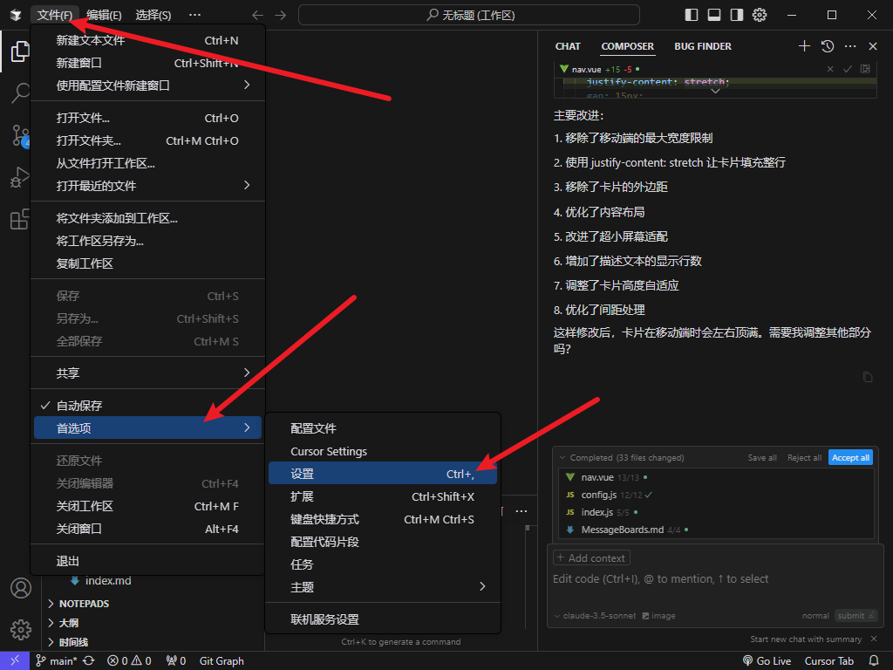

**搜索选项，改成另一个选项**

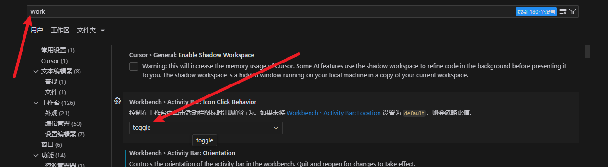

## Chat

通过快捷键`Ctrl + L`，唤出聊天框

也可以选择某一段代码`Ctrl+L`,会自动将选中的内容添加到对话框中，进行继续询问

可以点击聊天框中代码区右上角的`Apply`，把更改内容应用代码中

编辑器区会有不同颜色的代码

- **绿色**代表新增
- **红色**代表删除

如果后悔了，`Ctrl + Z` 再回退也可以

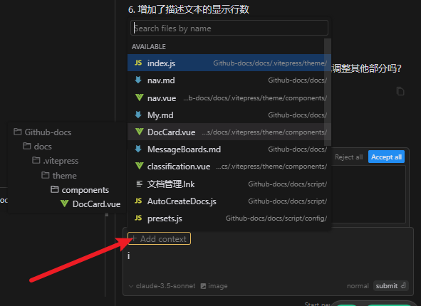

上下文区域，可以点击`add content`添加，也可以使用`@`，或者直接拖文件到对话框

**上下文**：你的问题基于这个上下文进行回答

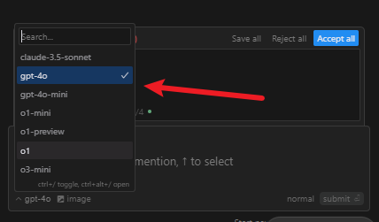

选择你喜欢的模型

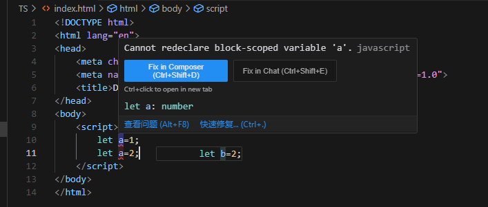

当一行代码有误时，将鼠标悬浮在其上面，可以选择右边的选项，会自动将错误信息作为问题在对话框中提问，

AI会给出解决方案，点击Apply将更改应用到你的代码中

## Composer

使用`Ctrl + i`，唤起对话框

使用@符号使用Web，指的是要求AI搜索一下网络资源

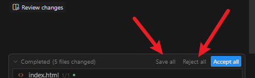

当不确定Ai的更改如何时候，可以点击`Sava All`，会先把本次所有的更改保存，如果不满意了再点击`Reject all`，取消本次所有更改

- **Composer**主要用于编写代码
- **chat**主要用于对话(它不会直接更改代码文件)

新建一个Composer对话框(`Ctrl + N`)，点击右上角的加号，开启新的一轮对话

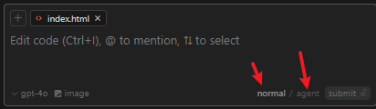

**normal**和**agent**都可以用于代码编写

**区别:**

**Agent**会更加智能，**normal**需要手动提及上下文，**Agent**会自动提取项目的代码作为上下文，自动搜索代码

**normal**只能做一些文件的修改或者创建，不能删除，移动，终端命令执行（无法自动进行一些高危操作），反而**Agent**可以

当**Agent**要执行终端命令时，会进行请求确认

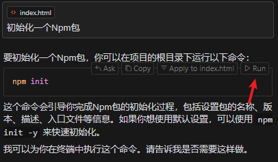

当自动操作删除了一些文件，突然后悔了，

AI每次删除会记录一次`CheckPoint`，旁边有个**Revert**，可以回退删除的文件

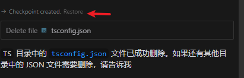

**聊天历史**

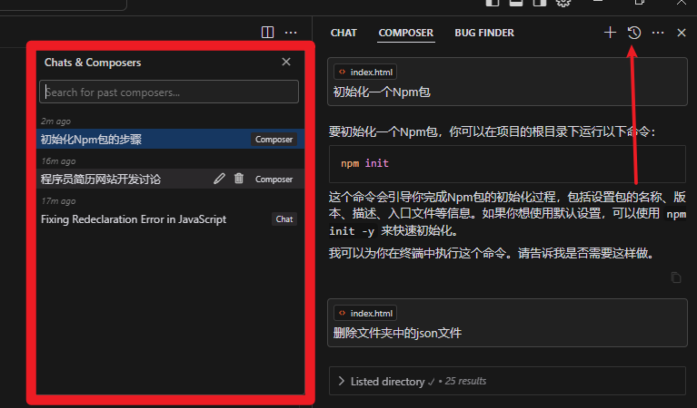

## Cmd  + K

选中某一段代码 `Ctrl + k`

自动将选中的代码作为提问的一部分

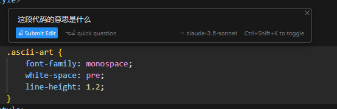

点击`quick question`会回答你的问题，继续提问，可以选择`submit Edit`，可以对代码进行更改

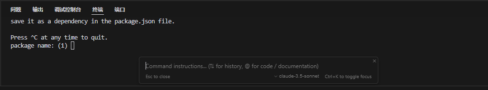

在终端也可以`Ctrl + K`

## Context

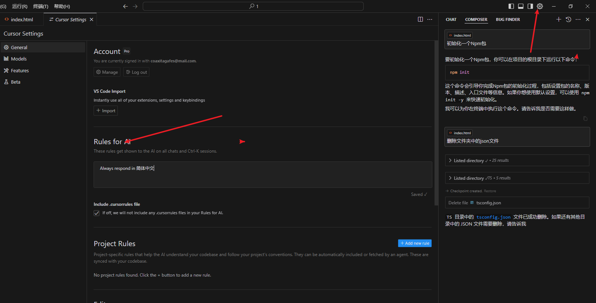

**全局上下文**这里的**规则或提示词**会应用到所有的对话

在这里可以添加一些你需要让它注意的**点**或者**规则**

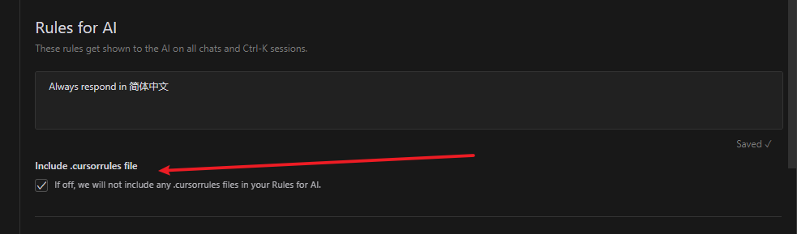

当勾选了这个选项，可以在某一个项目中单独创建一个文件，`.cursorrules`，在这个文件内写一些特有的规则或者提示针对当前项目

> [!IMPORTANT]
>
> 可能以后不再使用这种**文件**方式单独配置了

推荐的做法是：

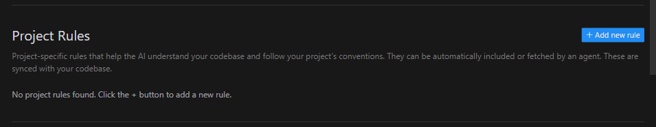

点击**添加规则**，在顶部输入一个规则名称，

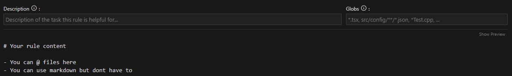

左边的输入框是描述，右边是匹配，代表要匹配哪些文件

## Rules

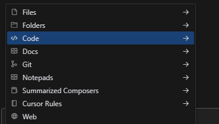

**Folders**:目录

**Notepads**:类似规则，用于附带一些规则

在左下角创建对应文件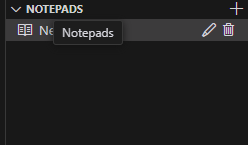

选中某一段代码`Ctrl + L`，将代码作为对话框内容的一部分，终端也可以

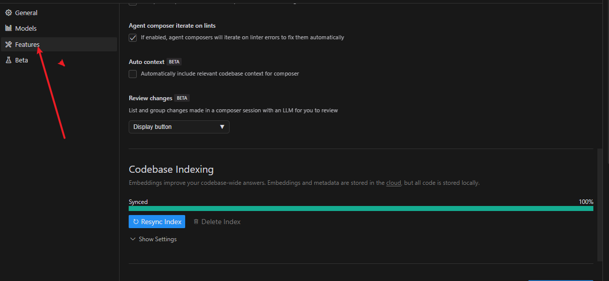

...

## Setting

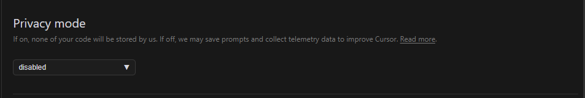

用于保证你的代码不会被进行收集训练的

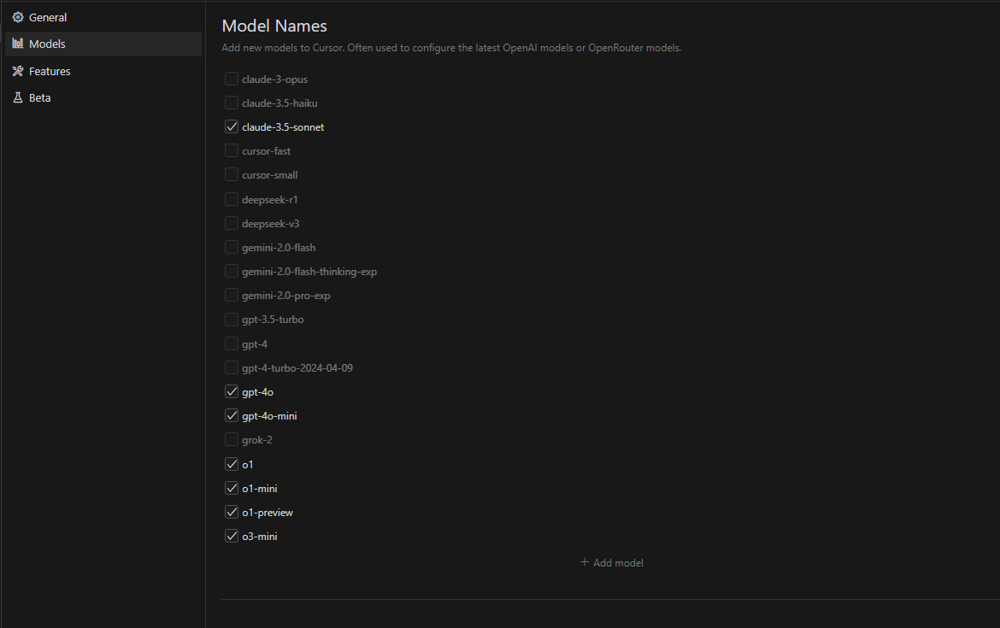

提供了一系列可以使用的模型

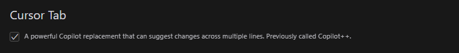

自动补全功能

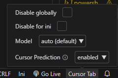

右下角也可以选择

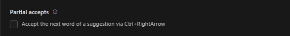

通过 Ctrl + 向右箭头接受建议的下一个单词

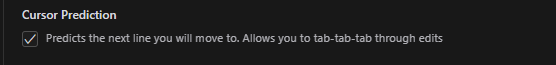

**翻译**：预测您将移动到的下一行。允许您通过 tab-tab-tab 键进行编辑

用于预测下一次或很多次的行为

**翻译：**在评论中启用或禁用光标选项卡建议

是否允许在注释中提供建议

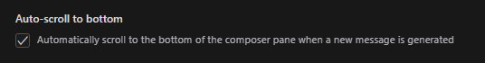

对话框中**回答内容**自动滚动到底部

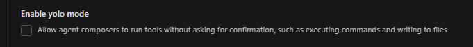

当勾选后，执行一些高危操作不再进行请求确认

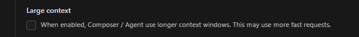

更大的上下文请求，

> [!WARNING]
>
> 会消耗更多的快速请求

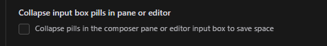

是否折叠对话框中提及内容

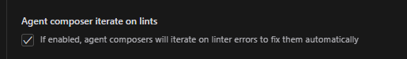

是否允许Agent模式自动修复错误，当在更改代码的时候，检测到代码的一些错误会自动修复

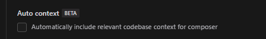

在对话框中自动包含需要的上下文

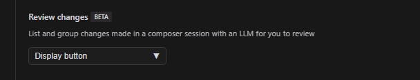

Display button

 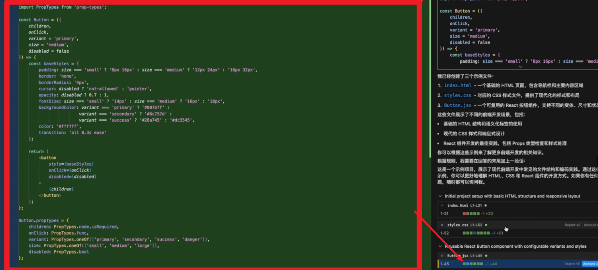

可以点击对应的选项定位到文件更改

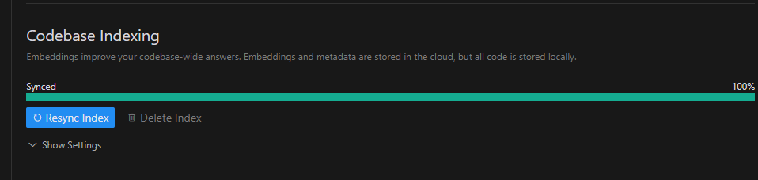

用于建立当前代码库的索引，能够在提问的时候帮助AI更好的检索代码仓库

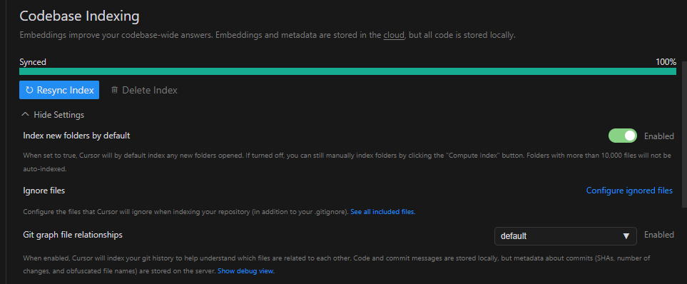

第一个选项用于 当新打开一个目录的时候，会自动建立对应的代码索引

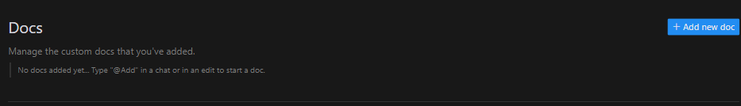

类似建立文档的索引，要求输入链接

在对话框可以@docs

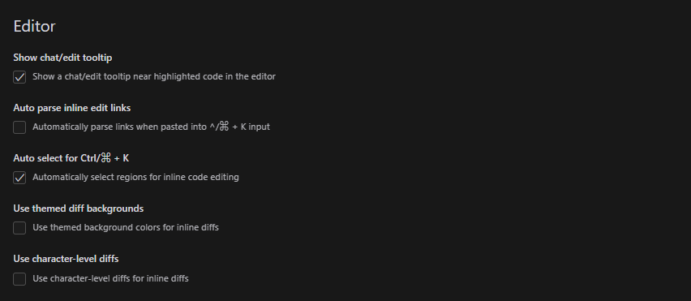

第一个用于选中代码(高亮代码)有快捷提示

第二个用于是否自动解析粘贴的链接

第三个用于 在选择一个代码行时 `Ctrl + K`，自动选中对应代码块

第四个用于 对比色不同

第五个用于 是否展示字符级别的差异

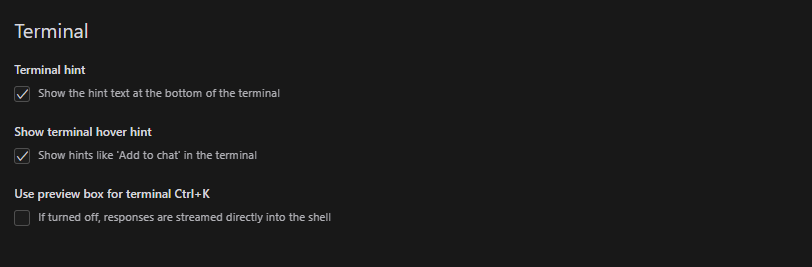

第一个 用于 在终端底部显示提示文本

第二个 用于 在终端中显示提示，例如 * Add to chat'

第三个 用于 预览命令
