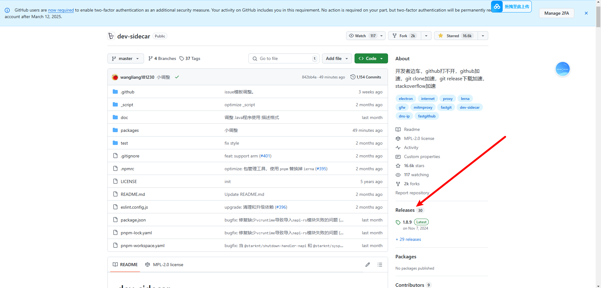

# Github/Git

## 访问

### 第一种方法

使用Wattt Toolkit

[Wattt Toolkit](https://steampp.net)

### 第二种方法

<u>前提是可以访问Github</u>

在顶部`Type to search`搜索框中搜索项目 **<u>dev sidecar</u>** 



点击Releases ，下拉，下载最新版本

<a href="https://wwyk.lanzoue.com/b00y9vcm7c" target="_blank">dev sidecar 直供下载</a><br/>
<CopyBlock text="2ljp" prompt='密码 : ' DisplayStatus="false" />

按照引导完成配置即可使用


## Git

当一个文件夹被Git管理起来后，就变成一个Git仓库，被Git管理的文件仓库下面会生成一个`.git`的子文件夹，用于存放Git的版本控制信息


Git使用`commit`(提交)作为版本控制的基本单元，每完成一次commit，Git都保存了一个仓库，此时状态的快照，文件夹里面所有文件的状态都被记录下来，随着commit的越来越多，会形成一条**commit的历史链路**。这样整个仓库都是可回溯的，可以查看历史记录的，每个项目参与者的每一个改动都会被这个commit链路记录下来

**Git仓库分为两种**：

- Local Repository 本地仓库
- Remote Repository 远端仓库
  - 私有仓库
  - 公开仓库（所有公开仓库在Github都可以被搜索到）

## 仓库

### Issue

用于与项目作者进行讨论

可以点击`New issue`发起一个讨论，比如提出你在项目中遇到的bug，帮助对项目进行完善或者对项目新功能的期待，也可以参与讨论或者帮助其他人解决问题

**Issue分为两种**：

open 指的是还没有解决的bug，或者还在讨论的问题

closed 指的是已经解决的bug，或者已经结束的讨论


在使用和学习开源项目中，不妨在搜索框 ↑  中搜一搜，因为有些问题别人可能也遇到了，并且在Issue中已经有人给出了解决方案

### 汉化

使用 **篡改猴** 使用**Github 汉化插件** 

[链接直达github-chinese](https://github.com/maboloshi/github-chinese)

> [!IMPORTANT]
>
> 此插件主要针对菜单，按钮功能汉化，无法对README文件内的英文进行汉化，可以借助其他插件，比如 <u>沉浸式翻译</u>

## 快捷键

`.`	网页版VsCode 

`/`	快速打开Github搜索框

`T`	快速定位到文件搜索栏

`L`	在代码中可以快速定位到行号

在选中的行前面有很多功能：

Copy line 复制这一行

Copy permalink 复制永久链接（可以通过分享链接，与其他人分享代码）

View git blame 查看文件提交历史（每行代码的提交者）

`?`	快捷键速查表

`G` `C`	快速查看代码

`G` `I`	快速查看Issue

...

> [!TIP]
>
> 如果想对代码进行调试，Github提供了一个codespace的运行环境
>
> 点击`运行/调试`按钮，点击`继续工作`，点击`Create New Codespace`，根据需求从Github申请一个远程的运行环境，点击`Run`，然后就可以在网页版Vscode中调试修改代码了

> [!CAUTION]
>
> Github Codespace 有一定的免费使用额度
>
> 在账号`Settings`，在`Billing and plans`点击`Plans and usage`，往下找到**codespaces**的使用额度，每个账号每个月提供120小时的免费使用额度，超过则需要付费

## 搜索功能

- 下载好用的工具
- 收藏项目，关注开发者
- 下载学习开源代码
- DIY代码，添加功能
- 为开源代码做出自己的贡献

### explore

热门仓库以及兴趣推荐等...

[点击跳转explore](https://github.com/explore)

### search

搜索你感兴趣的项目

可以搜索项目，代码，讨论等...

或者使用**高级搜索**

在Github搜索框中输入 `saved:`点击`Manage saved searches`即可创建搜索预设

[点击跳转search](https://github.com/search)

### stars

查看所有你点击过stars的项目

[点击跳转stars](https://github.com/stars)

### GithubDesktop

[点击跳转GithubDesktop](https://desktop.github.com/download/)

## 下载与使用

### Releases

根据实际需求下载对应安装包

在CMD窗口输入`wmic cpu get caption`查看CPU架构

如果没有Releases，查看项目简介...

### docker

在项目说明文档，查看是否有Docker命令脚本，找一个已经配置好的Docker运行环境的电脑，执行启动脚本，即可一键运行Docker程序

### 一键云部署

在项目说明文档，有些会有一键部署按钮

### 下载代码

- 下载代码
- 配置运行环境
- 安装依赖
- 找到入口文件即可启动

在说明文档中一般有详细的项目搭建方式

## 历史起源

[Git与GIthub的故事](https://blog.brachiosoft.com/en/posts/git)

## 开源协议


GPL：其他人修改完代码的项目也必须保持开源（衍生作品也必须开源）

争议：具有传染性，意味着如果一个项目使用了部分GPL代码，则整个项目都必须遵循GPL协议，而且必须保持开源

LGPL：宽松版的GPL协议，新增部分的代码不必要使用原版协议，这样不怕GPL协议传染整个项目

Apache：需要为每个修改后的文件放置版权说明

MIT/BSD：只需要在项目中保留一份协议的副本 ，就可以几乎随意使用开源代码

 BSD：不可使用原作者的名字对项目进行促销推广

## Github Gist

一般用来分享单个代码文件，或者是小的代码片段

#### 分享方式

##### 嵌入

```js
<script src="https://gist.github.com/yumengjianghu/971e97c8855a5bb8e7ba2756f3985dfc.js"></script>
```

##### 分享

https://gist.github.com/yumengjianghu/971e97c8855a5bb8e7ba2756f3985dfc

即可观看代码

##### 克隆

HTTPS/SSH

## Git分支

分支就是存储库的不同版本，默认情况，每个repository仓库都有一个main分支或者master分支，也就是主干分支，创建分支就是创建一个副本，比如我从main分支创建了一个叫feature的分支，可以在上面进行我的开发工作，创建的这个是主干分支当时状态的快照，也就是feature刚创建出来的时候，它与主干分支的代码一样，当你对feature分支代码进行修改时，这个修改只对feature分支有效，只能在feature分支被看到，而不会影响主干，当你切换回main主分支的时候，是看不到feature分支代码的修改的，也就意味着在各自分支上的代码修改不会互相影响，分支对于多人协作非常有用，每个人都可以创建一个自己的分支，在自己的分支上进行功能的开发，不会影响其他人，一旦功能开发结束，可以把分支合并回主干，此操作称为**merge**

[**Git教程动画**](https://pcottle.github.io/learnGitBranching/)

[learnGitBranching项目](https://github.com/pcottle/learnGitBranching)

### 创建分支

在Github上创建分支


**基于main分支以外的分支也可以创建分支**

在仓库页面点击**分支**


如果分支基于feature分支创建，那么分支将包含之前feature分支和main分支所有的代码，但是如果只是基于main创建只能看到main分支的代码

### pull reauest

意思是 **拉取请求**（合并请求）

将更改从一个分支合并进另外一个分支的提案，通常来说，项目的贡献者在自己的分支上进行代码修改，然后他会创建一个pull request，也就是把自己的分支合并进主干分支的提案

pull request**会比较两个分支之间的代码差异**

然后仓库的管理员会来审核这个代码的改动，这个过程叫做Code review也就是代码设计，在代码审核过程中，管理员可以提出自己的修改意见，当管理员确认代码改动是OK的以后，他会同意合并，这样特性分支的代码就会合并进主干分支，功能开发也就完成

### 创建pull request

点击`pull request`选项，再点击`New pull request`选项

然后选择合并方向

对修改确认无误后，点击`Create pull request`，写一个标题，填写描述，完成后点击`Create pull request`

管理员可以点击`Files changed`开始审核代码 


审核时，管理员可以比较代码的不同，他可以在某一行上点击加号留下评论，最终他会给一个代码审核的意见


最后，管理员认为代码OK，可以合并的时候，就可以点击`merge pull request`


## Github工作流程


## Github其他功能

### GIthub WiKi

用于存放项目的详细文档，指南，API文档，设计文档。适合放置**较大，结构化**的文档内容

点击头部的wiki标签栏即可进入

Wiki也是一个独立的Git仓库，可以独立克隆和推送

### GIthub Insights

用于帮助项目维护者和贡献者分析和理解他们代码库的状态和活动。


#### Pulse

pulse提供了项目的简要活动概要，包括：

已合并的拉取请求（Merged Pull Request）

开启的拉取请求（open Pull request）

关闭的问题 （Close issues）

新开启的问题（New Issues）

Pulse是一个快速查看项目近期互动的好方法，可以让你了解项目的动态。

#### Contributors

这个部分展示了所有的贡献者的详细信息，包括每个贡献者的提交者，添加和删除的代码行数等，它帮助识别主要贡献者以及他们对项目的贡献量

#### Traffic

Traffic insights提供了有关项目访问量的详细信息

#### Dependabot

Dependabot是一个GIthub自动化的功能，可以**定时检查依赖项有无更新**，如果存在依赖的库有版本更新，那就自动创建**pull request** 帮助更新到最新版本

```yaml
# To get started with Dependabot version updates, you'll need to specify which
# package ecosystems to update and where the package manifests are located.
# Please see the documentation for all configuration options:
# https://docs.github.com/code-security/dependabot/dependabot-version-updates/configuration-options-for-the-dependabot.yml-file

version: 2
updates:
  - package-ecosystem: "npm" # See documentation for possible values
    directory: "/" # Location of package manifests
    schedule:
      interval: "weekly"

```

`package-ecosystem`指的是**包管理**工作名字

`directory`指的是项目依赖文件的**目录**

`interval`**扫描间隔** - weekly指的是每周扫描一次

Dependabot更多功能

[点击跳转](https://docs.github.com)

进入后搜索 **dependabot.yml** 即可深度学习Dependabot的配置

### Github Project

Github Project就是项目看板，是一种可视化管理工具，用于组织和跟踪项目的进度任务

- **Todo** 是代办事项
- **In Progress** 是进行中事项
- **Done** 是完成事项

点击卡片左下角即可创建事项

#### current iteration

current iteration 指的是当前迭代的工单状态

迭代 是敏捷开发里面的一个专业术语，一般两个星期是一个迭代，每个迭代上线一批功能，然后经过QA测试，然后推送上线，也可以自己定义迭代的时间周期等等的，在右上角的设置里面调节

### Github Discussion

 围绕项目的论坛

一般discussion是比较大的项目启用的功能，小项目用Issue即可

## GIthub Desktop安装配置

[点击跳转GithubDesktop](https://desktop.github.com/download/)

## Git区概念

- 工作区
- 暂存区
- 本地仓库
- 远程仓库


## 评论
<Giscus />