# Github/Git

## 访问

### 第一种方法

使用Wattt Toolkit

[Wattt Toolkit](https://steampp.net)

### 第二种方法

<u>前提是可以访问Github</u>

在顶部`Type to search`搜索框中搜索项目 **<u>dev sidecar</u>** 


点击Releases ，下拉，下载最新版本

<a href="https://wwyk.lanzoue.com/b00y9vcm7c" target="_blank">dev sidecar 直供下载</a><br/>
<CopyBlock text="2ljp" prompt='密码 : ' DisplayStatus="false" />

按照引导完成配置即可使用


## Git

当一个文件夹被Git管理起来后，就变成一个Git仓库，被Git管理的文件仓库下面会生成一个`.git`的子文件夹，用于存放Git的版本控制信息


Git使用`commit`(提交)作为版本控制的基本单元，每完成一次commit，Git都保存了一个仓库，此时状态的快照，文件夹里面所有文件的状态都被记录下来，随着commit的越来越多，会形成一条**commit的历史链路**。这样整个仓库都是可回溯的，可以查看历史记录的，每个项目参与者的每一个改动都会被这个commit链路记录下来

**Git仓库分为两种**：

- Local Repository 本地仓库
- Remote Repository 远端仓库
  - 私有仓库
  - 公开仓库（所有公开仓库在Github都可以被搜索到）

## 仓库

### Issue

用于与项目作者进行讨论

可以点击`New issue`发起一个讨论，比如提出你在项目中遇到的bug，帮助对项目进行完善或者对项目新功能的期待，也可以参与讨论或者帮助其他人解决问题

**Issue分为两种**：

open 指的是还没有解决的bug，或者还在讨论的问题

closed 指的是已经解决的bug，或者已经结束的讨论


在使用和学习开源项目中，不妨在搜索框 ↑  中搜一搜，因为有些问题别人可能也遇到了，并且在Issue中已经有人给出了解决方案

### 汉化

使用 **篡改猴** 使用**Github 汉化插件** 

[链接直达github-chinese](https://github.com/maboloshi/github-chinese)

> [!IMPORTANT]
>
> 此插件主要针对菜单，按钮功能汉化，无法对README文件内的英文进行汉化，可以借助其他插件，比如 <u>沉浸式翻译</u>

## 快捷键

`.`	网页版VsCode 

`/`	快速打开Github搜索框

`T`	快速定位到文件搜索栏

`L`	在代码中可以快速定位到行号

在选中的行前面有很多功能：

Copy line 复制这一行

Copy permalink 复制永久链接（可以通过分享链接，与其他人分享代码）

View git blame 查看文件提交历史（每行代码的提交者）

`?`	快捷键速查表

`G` `C`	快速查看代码

`G` `I`	快速查看Issue

...

> [!TIP]
>
> 如果想对代码进行调试，Github提供了一个codespace的运行环境
>
> 点击`运行/调试`按钮，点击`继续工作`，点击`Create New Codespace`，根据需求从Github申请一个远程的运行环境，点击`Run`，然后就可以在网页版Vscode中调试修改代码了

> [!CAUTION]
>
> Github Codespace 有一定的免费使用额度
>
> 在账号`Settings`，在`Billing and plans`点击`Plans and usage`，往下找到**codespaces**的使用额度，每个账号每个月提供120小时的免费使用额度，超过则需要付费

## 搜索功能

- 下载好用的工具
- 收藏项目，关注开发者
- 下载学习开源代码
- DIY代码，添加功能
- 为开源代码做出自己的贡献

### explore

热门仓库以及兴趣推荐等...

[点击跳转explore](https://github.com/explore)

### search

搜索你感兴趣的项目

可以搜索项目，代码，讨论等...

或者使用**高级搜索**

在Github搜索框中输入 `saved:`点击`Manage saved searches`即可创建搜索预设

[点击跳转search](https://github.com/search)

### stars

查看所有你点击过stars的项目

[点击跳转stars](https://github.com/stars)

### GithubDesktop

[点击跳转GithubDesktop](https://desktop.github.com/download/)

## 下载与使用

### Releases

根据实际需求下载对应安装包

在CMD窗口输入`wmic cpu get caption`查看CPU架构

如果没有Releases，查看项目简介...

### docker

在项目说明文档，查看是否有Docker命令脚本，找一个已经配置好的Docker运行环境的电脑，执行启动脚本，即可一键运行Docker程序

### 一键云部署

在项目说明文档，有些会有一键部署按钮

### 下载代码

- 下载代码
- 配置运行环境
- 安装依赖
- 找到入口文件即可启动

在说明文档中一般有详细的项目搭建方式

## 历史起源

[Git与GIthub的故事](https://blog.brachiosoft.com/en/posts/git)

## 开源协议


GPL：其他人修改完代码的项目也必须保持开源（衍生作品也必须开源）

争议：具有传染性，意味着如果一个项目使用了部分GPL代码，则整个项目都必须遵循GPL协议，而且必须保持开源

LGPL：宽松版的GPL协议，新增部分的代码不必要使用原版协议，这样不怕GPL协议传染整个项目

Apache：需要为每个修改后的文件放置版权说明

MIT/BSD：只需要在项目中保留一份协议的副本 ，就可以几乎随意使用开源代码

 BSD：不可使用原作者的名字对项目进行促销推广

## Github Gist

一般用来分享单个代码文件，或者是小的代码片段

#### 分享方式

##### 嵌入

```js
<script src="https://gist.github.com/yumengjianghu/971e97c8855a5bb8e7ba2756f3985dfc.js"></script>
```

##### 分享

https://gist.github.com/yumengjianghu/971e97c8855a5bb8e7ba2756f3985dfc

即可观看代码

##### 克隆

HTTPS/SSH

## Git分支

分支就是存储库的不同版本，默认情况，每个repository仓库都有一个main分支或者master分支，也就是主干分支，创建分支就是创建一个副本，比如我从main分支创建了一个叫feature的分支，可以在上面进行我的开发工作，创建的这个是主干分支当时状态的快照，也就是feature刚创建出来的时候，它与主干分支的代码一样，当你对feature分支代码进行修改时，这个修改只对feature分支有效，只能在feature分支被看到，而不会影响主干，当你切换回main主分支的时候，是看不到feature分支代码的修改的，也就意味着在各自分支上的代码修改不会互相影响，分支对于多人协作非常有用，每个人都可以创建一个自己的分支，在自己的分支上进行功能的开发，不会影响其他人，一旦功能开发结束，可以把分支合并回主干，此操作称为**merge**

[**Git教程动画**](https://pcottle.github.io/learnGitBranching/)

[learnGitBranching项目](https://github.com/pcottle/learnGitBranching)

### 创建分支

在Github上创建分支

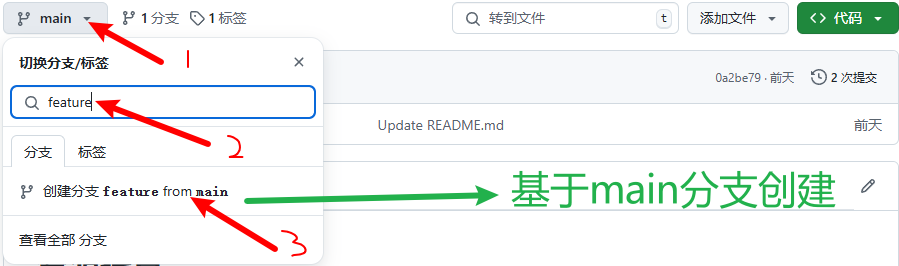

**基于main分支以外的分支也可以创建分支**

在仓库页面点击**分支**

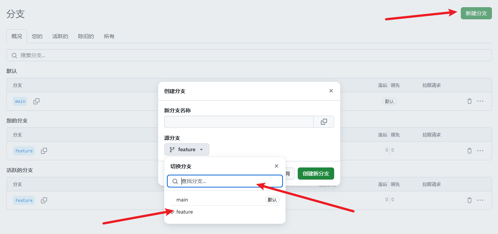

如果分支基于feature分支创建，那么分支将包含之前feature分支和main分支所有的代码，但是如果只是基于main创建只能看到main分支的代码

### pull reauest

意思是 **拉取请求**（合并请求）

将更改从一个分支合并进另外一个分支的提案，通常来说，项目的贡献者在自己的分支上进行代码修改，然后他会创建一个pull request，也就是把自己的分支合并进主干分支的提案

pull request**会比较两个分支之间的代码差异**

然后仓库的管理员会来审核这个代码的改动，这个过程叫做Code review也就是代码设计，在代码审核过程中，管理员可以提出自己的修改意见，当管理员确认代码改动是OK的以后，他会同意合并，这样特性分支的代码就会合并进主干分支，功能开发也就完成

### 创建pull request

点击`pull request`选项，再点击`New pull request`选项

然后选择合并方向

对修改确认无误后，点击`Create pull request`，写一个标题，填写描述，完成后点击`Create pull request`

管理员可以点击`Files changed`开始审核代码 

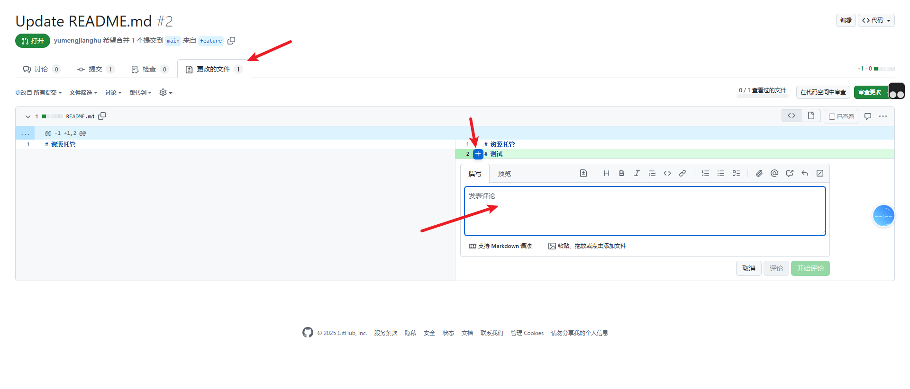

审核时，管理员可以比较代码的不同，他可以在某一行上点击加号留下评论，最终他会给一个代码审核的意见


最后，管理员认为代码OK，可以合并的时候，就可以点击`merge pull request`

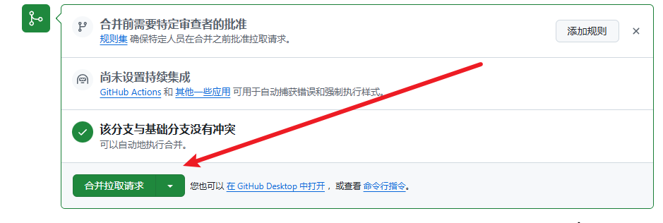

## Github工作流程


## Github其他功能

### GIthub WiKi

用于存放项目的详细文档，指南，API文档，设计文档。适合放置**较大，结构化**的文档内容

点击头部的wiki标签栏即可进入

Wiki也是一个独立的Git仓库，可以独立克隆和推送

### GIthub Insights

用于帮助项目维护者和贡献者分析和理解他们代码库的状态和活动。


#### Pulse

pulse提供了项目的简要活动概要，包括：

已合并的拉取请求（Merged Pull Request）

开启的拉取请求（open Pull request）

关闭的问题 （Close issues）

新开启的问题（New Issues）

Pulse是一个快速查看项目近期互动的好方法，可以让你了解项目的动态。

#### Contributors

这个部分展示了所有的贡献者的详细信息，包括每个贡献者的提交者，添加和删除的代码行数等，它帮助识别主要贡献者以及他们对项目的贡献量

#### Traffic

Traffic insights提供了有关项目访问量的详细信息

#### Dependabot

Dependabot是一个GIthub自动化的功能，可以**定时检查依赖项有无更新**，如果存在依赖的库有版本更新，那就自动创建**pull request** 帮助更新到最新版本

```yaml
# To get started with Dependabot version updates, you'll need to specify which
# package ecosystems to update and where the package manifests are located.
# Please see the documentation for all configuration options:
# https://docs.github.com/code-security/dependabot/dependabot-version-updates/configuration-options-for-the-dependabot.yml-file

version: 2
updates:
  - package-ecosystem: "npm" # See documentation for possible values
    directory: "/" # Location of package manifests
    schedule:
      interval: "weekly"

```

`package-ecosystem`指的是**包管理**工作名字

`directory`指的是项目依赖文件的**目录**

`interval`**扫描间隔** - weekly指的是每周扫描一次

Dependabot更多功能

[点击跳转](https://docs.github.com)

进入后搜索 **dependabot.yml** 即可深度学习Dependabot的配置

### Github Project

Github Project就是项目看板，是一种可视化管理工具，用于组织和跟踪项目的进度任务

- **Todo** 是代办事项
- **In Progress** 是进行中事项
- **Done** 是完成事项

点击卡片左下角即可创建事项

#### current iteration

current iteration 指的是当前迭代的工单状态

迭代 是敏捷开发里面的一个专业术语，一般两个星期是一个迭代，每个迭代上线一批功能，然后经过QA测试，然后推送上线，也可以自己定义迭代的时间周期等等的，在右上角的设置里面调节

### Github Discussion

 围绕项目的论坛

一般discussion是比较大的项目启用的功能，小项目用Issue即可

## GIthub Desktop安装配置

[点击跳转GithubDesktop](https://desktop.github.com/download/)

### 进阶操作

#### **部分提交**


#### 放弃更改

右键文件，选择`Discard changes`即可放弃更改，指的是放弃这个文件在本地目录(工作区)的修改

把这个文件(**工作区**)同步成本地分支(**本地仓库**)的样子

> [!NOTE]
>
> 放弃的文件会添加到**回收站**内，文件可在**电脑本地回收站**再次找回


#### 保存更改

```bash
git stash		
```


右键 `1 changed file`，第一个是**放弃所有更改**，第二个是**保存所有更改**

此时本地文件已经没有`保存的更改代码`了

**查看保存的更改代码**：


保存更改代码后，即可随意切换分支了

> [!IMPORTANT]
>
> 局限性：Desktop最多只能存储一次的改动，Git命令行则没有，它可以存储很多次的改动

如果直接强行切换分支，会有两个选择，

第一个`Leave my changes on feature`就是存储更改代码

第二个`Bring my changes to main`将更改代码带向main分支

**总结**：

> [!TIP]
>
> **场景**：如果你有开发了一半的代码，现在出现了一个临时紧急工作，需要切换分支进行处理。
>
> 对于还没有提交的改动我们可以进行一下处理:
>
> | 操作方法 | git命令                                   | 修改                                       |
> | -------- | ----------------------------------------- | ------------------------------------------ |
> | commit   | git add. + git commit -m 'commit message' | 工作区文件提交本地分支                     |
> | stash    | git stash                                 | 将改动保存起来                             |
> | discard  | git reset --hard                          | 抛弃工作区与暂存区的更改                   |
> | switch   | git switch ‘branch name’                  | 直接切换分支，你的本地改动会带到新分支上。 |
>
> 

#### 撤回提交

```bash
git reset
```

点击`History`，右键之前版本选择`Reset to commit`即可

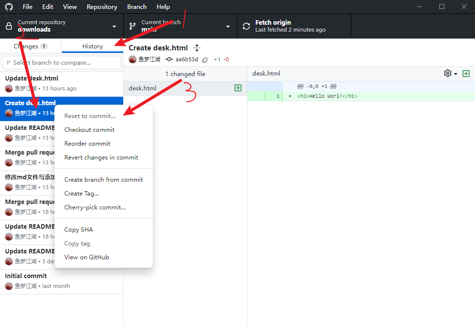

> [!NOTE]
>
> 撤销提交后，但是文件改动保存了下来

> [!CAUTION]
>
> 推送远端后不允许`Reset`，只限于Desktop，不允许一些高危操作
>
> **但是可以使用Git命令行进行操作**
>
> 右键仓库选择`Open in Command Prompt`打开命令提示符
>
> **查看历史提交记录**
>
> ```bash
> git log
> ```
>
> 提醒：按`Q`键退出
>
> ```bash
> git reset --mix 'ID'
> ```
>
> **mix**指的是撤销提交，但是保留我的本地文件更改
>
> 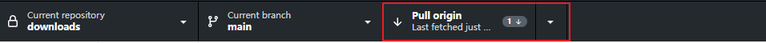
>
> 意思： 本地仓库分支与远端仓库没有同步，远端仓库有一个提交，但是本地没有，因为刚刚通过命令行撤回了，**如果点击`pull`会把那次提交又拿回来了**
>
> 继续使用命令行操作
>
> **把本地分支强行推送远程仓库**
>
> ```bash
> git push -f
> ```
>
> `-f`指的是强制推送，不论远端分支是什么状态，就把**本地分支强制覆盖到远端**（高危操作）
>
> 

#### 反向提交

```bash
git revert
```

在`History`页面右键版本选择`Revert changes in commit`生成了一个新的提交，最后推送即可

Revert 的意思是使用**反向操作**抵消上一次的更改（类似后悔药）

**反向操作**：比如之前是删除一行代码，那就是增加一行代码，反之，新增则是删除

> [!IMPORTANT]
>
> 在多人协作开发中，我们应该使用**revert操作**，而不是使用**命令行reset操作**，因为推送到远端后，不允许reset后提交，只能拉回代码，但是可以使用命令行强制推送覆盖远端仓库


```bash
git commit --amend
```

右键版本选择`Amend commit...`  ，意思是修正更改，点击后即可重新编辑**提交信息**或者**代码**

完成后点击`Amend last commit`，**注意：并没有产生新的提交，只是把上一次的提交修正一下**

**注意：只适用于最新的提交**

> [!WARNING]
>
> 如果提交已经推送，再点击`Amend commit...`  ，会进行警告，提示我们这次修改完后，必须使用**force push**强制推送才能把修改推送到远端

**后悔总结**：

| Git操作 | Git命令                                                      | 使用场景                                 | 注意事项                                                     |
| ------- | ------------------------------------------------------------ | ---------------------------------------- | ------------------------------------------------------------ |
| discard | git restore '文件名' (单个文件)    git reset --hard (所有文件) | 工作区的修改还未commit                   | 舍弃掉工作区修改的文件                                       |
| reset   | git reset 'commit ID'                                        | 还原到某个commit状态，舍弃之后的commit   | 如果reset已经推送到远端的commit，会强制推送，集成分支禁止强制推送 |
| revert  | git revert 'commit ID'                                       | 使用一个新的提交抵消掉某一次commit的修改 |                                                              |
| amend   | git commit --amend                                           | 只能修改最新一次commit                   | 如果amend 已经推送到远端的commit，会强制推送，集成分支禁止强制推送 |

#### 标签

`Tag`意思把选中的版本标记为一个项目的重要事件

可以创建一个Tag作为软件的版本号

**操作**：右键历史版本选择`create tag`，写一个tag名称，比如`v1.3.5`，表示这一次提交就是项目的v1.3.5版本，之后可以使用版本号进行版本发布，**记得push**

### 分支合并

之前使用**Github网站**进行`pull request`进行合并

使用**GIthub Desktop**进行`merge`分支合并

```bash
git merge
```

首先切换到接受合并的分支

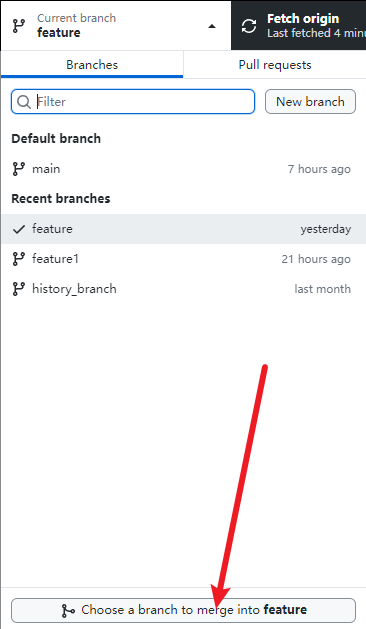

点击`Choose a branch to merge into feature`，选择一个分支合并进feature分支


#### `Create a merge commit`

```bash
git merge main
```


**Create a merge commit**：创建一个新的commit，合并到一起

#### `Squash and merge`

```bash
git merge --squash main
```


**Squash and merge**：把commit3,4,5压缩成一个提交合并进feature分支

#### `Rebase`

```bash
git rebase main
```


**Rebase**（变基 - 更改地基）：把main分支合并进了feature分支，把feature分支变基到了main分支

变基：我自己的根基不存在了，把自己的分支变更到了main分支上，并且生成一个新的提交

> [!IMPORTANT]
>
> 在Desktop使用**变基**，**提示**必须强制推送到GIthub网站`Git push -f`

| 操作     | rebase                     | merge                                          | squash merge                   |
| -------- | -------------------------- | ---------------------------------------------- | ------------------------------ |
| 特点     | 只有线性提交记录           | 会出现所有提交记录，包括merge                  | 只出现一条merge记录            |
| 优点     | 减少一次merge记录          | 保证分支可溯源                                 | 历史记录更加清爽干净           |
| 缺点     | 必须使用强送               | 多一次merge记录                                | 历史记录被合并到一起了         |
| 应用场景 | 在私有分支上可以使用rebase | 多人协作分支必须merge，向主干分支合并必须merge | 多人协作分支，需要保持记录清爽 |

 网页中`pull request`又有一样选项

Github网页有相关**图形化界面**功能

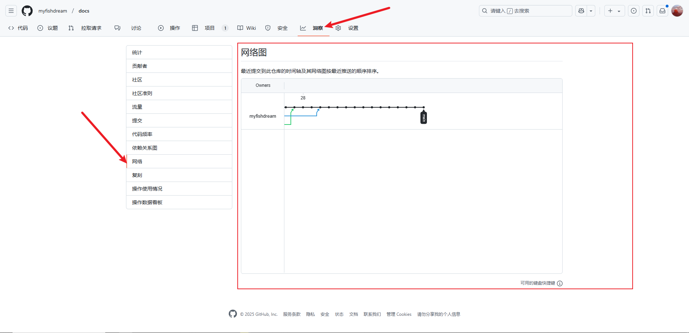

### 优选提交

**cherry pick**指的是优选提交或者拣选调教

> 比如说只想把commit3，commit3合并到main分支，保留commit5分支在feature分支

> [!IMPORTANT]
>
> **使用命令行操作**
>
> 切换到接受合并的分支
>
> ```bash
> git switch main
> ```
>
> 选择c3，c4两个commit
>
> ```bash
> git cherry-pick c3 c4
> ```
>
> 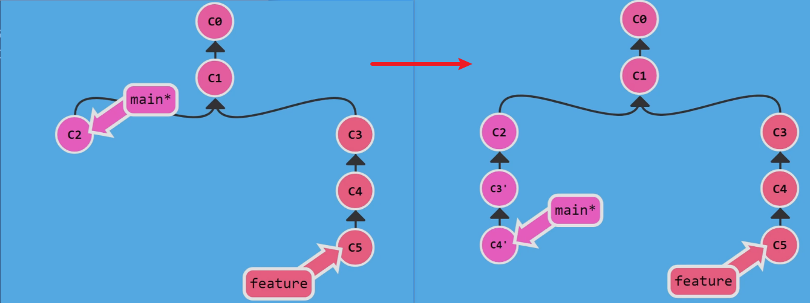
>
> **使用Desktop操作**
>
> 按住`shift`键同时选择多个commit，右键选择`Cherry-pick...`，指的是拣选选中的提交
>
> 选择要合并的分支，最后点击`Cherry-pick commit to main`即可

> [!WARNING]
>
> 在Desktop中`Cherry-pick`时，要将分支切换到输出commit的分支，然后再选择若干个commit，命令行则反之

## 解决合并冲突

如果两个分支同时修改了同一个文件的同一行代码，合并的时候就会出现conflict（冲突）

只能手动修改文件来解决冲突

**resolve conflict**

> [!CAUTION]
>
> 在Desktop上会有警告
>
> There will be 1 conflicted file when merging feature into main
>
> 将 feature 合并到 main 时将出现 1 个冲突文件

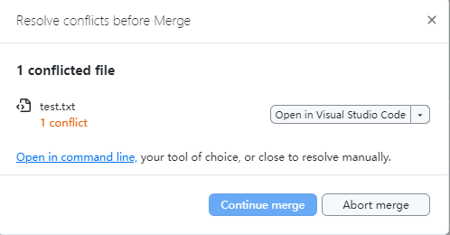

**Abort merge**：取消这次的merge，两个分支各自还原回去

**Continue merge**：需要先手动解决冲突，即编辑文件，修改成理想状态


修改完后即可回到Desktop点击`Continue merge`

## pull时冲突

> [!NOTE]
>
> 场景：你的同事，她已经写完代码并且推送到远程仓库，但是你本地不知道，你修改了同一个文件的同一行，此时你还没有提交

### Desktop

点击`pull origin`，提示冲突，如果拉取更新会将本地代码覆盖，点击`Stash changes and continue`，存储更改并继续，此时进入文件修改冲突，回到Desktop✔表示已经解决了，即可commit提交了再push了

这样就解决了本地跟远端的冲突

### 命令行

在main上合并feature分支

```bash
git merge feature
```

会显示冲突信息

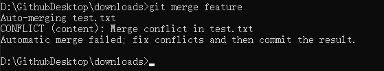

打开编辑器手动处理冲突

处理结束后，将处理的文件添加到**暂存区**，再进行一次提交才算解决冲突

```bash
git add test.txt
```

```bash
git commit -m 'Resolve test file conflict'
```

### 文件冲突

#### Desktop

> [!NOTE]
>
> 场景：两个分支同时改动了同一个文件的名字

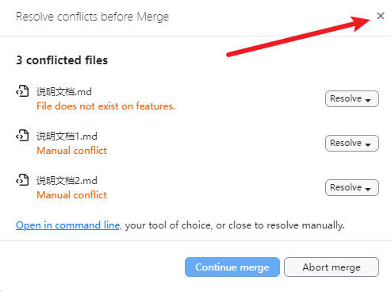

点击关闭提示


选中所有文件右键`Discard 3 selected changes`全部撤销更改

打开目录调整为理想状态回到Desktop

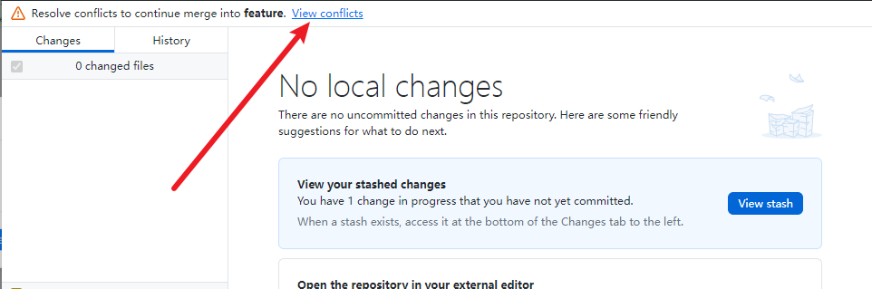

点击`View conflicts`，最后再提交上去即可

#### 命令行

```bash
git merge main
```

提示冲突

```bash
git status
```

按照命令行提示操作

```bash
git rm 'file name'
```

删除不要的文件

```bash
git rm 'abandon file name'
```

保留需要的文件

```bash
git add 'retain file name'
```

最后检查一下状态

```bash
git status
```

提示没有冲突，变成绿色即成功解决冲突

最后使用commit命令提交

```bash
git commit -m 'Resolve file name conflict'
```

最后记得推送至远端

## 贡献者流程

一般先点击Issue参加讨论，可以把你的想法通过Issue和开发者进行交流

可以提一个Issue，填写标题和描述，描述你的大体的实现思路，实现完成后会提交pull request，请问维护者，大家觉得怎么样，**提交Issue**

如果开发者看到了一个Issue并且觉得不错，会回答你：期待你PR

**贡献**:

**第一步：**

先fork复刻项目，把项目复制一份到自己的名下

**第二步：**

在`Code`按钮，找到HTTPS复制，回到Desktop，找到`Clone repository...`输入即可

**第三步：**

创建分支，在分支上进行功能开发，而不是直接使用main分支

开发完功能后，提交一下，提交信息：实现xxx功能

**第四步：**

点击`Publish branch`推送远端

**第五步：**
同步一下母项目的代码，防止提交PR的时候不会产生冲突

回到GIthub仓库，点击`Sync fork`，从母项目往子项目同步代码

**第六步：**

把子项目的main分支合并到feature分支

因为子项目feature分支是个人分支，可以减少一次merge记录，选择Rebase，出现冲突按照需求解决即可

**第七步：**

点击`Force push origin`强制推送

通过了rebase方法同步了母项目代码，防止提交PR的时候不会产生冲突

**第八步：**

创建PR

当项目管理者认为代码可以的时候，点击`Merge pull request`

当图标变成**紫色Merged**

完成了对开源代码的贡献

仓库的Contributors就会出现贡献者的名字

贡献者可以回到本地将开发分支删除，保留main分支随时关注母项目的改动，有改动点击`sync fork`同步代码

如果还想进行功能开发，再在Desktop创建分支进行开发就行了

## IDEA使用Git

**基础**

**VSC**:版本控制系统

当把代码克隆到本地后，文件夹会出现很多文件夹

IDEA作为一个代码编辑软件，它会自动生成一些文件，但是这些文件不应该提交到git里面的，配置文件只是你自己本地使用的，其他开发者可能并不使用IDEA，否则别人下载文件会携带无用文件

创建 **.gitignore** 文件用于忽略文件或者文件夹不需要被Git管理的

> [!NOTE]
>
> IDEA提供了一种简单的方法创建
>
> 在文件上点击右键选择Git,点击Add to .gitignore

> [!CAUTION]
>
> **文件夹**的**后面**有一个斜杠，代表这是一个文件夹
>
> ```
> /tool.iml
> .idea/
> node/
> ```

点击左边的commit按钮，操作和Desktop类似

> [!IMPORTANT]
>
> 如果远程仓库已经有你想忽略的文件，那么要先把添加到.gitignore，把文件从本地仓库移除，推送远端，远端会删除
>
> 再把文件还原回到本地仓库
>
> 这样以后再提交就不会带此文件了

### pull

在左下角有一个git的选项卡，点击后选择要拉取的分支，点击下小箭头（Update Selected）意思是（git fetch<u>取得远端更新</u> + git pull）完成远程仓库拉取本地仓库

### 分支操作

点击git选项卡的小加号`+`创建分支，创建的分支是基于当前分支创建的，右键点击push推送

### 远端合并本地

#### merge

点击update获取远端更新，右键要切换的分支选择check out ,选择远端的main分支右键`Merge 'origin/main' into 'feature`把main分支的改动merge进feature分支

> [!IMPORTANT]
>
> 分支上有一个绿色向上的小箭头代表更改还没有push上期，当前只是把远端的代码合并到本地，没有push

#### rebase

切换到接受合并的分支，选择要合并的分支点击`Rebase 'feature2' onto 'origin/main`，指的是把feature分支变基到main分支上（类似把main分支merge到feature分支上）

> [!IMPORTANT]
>
> 右键push时候，按钮的小箭头可以选择`force push`强制推送

**进阶**

### 解决冲突

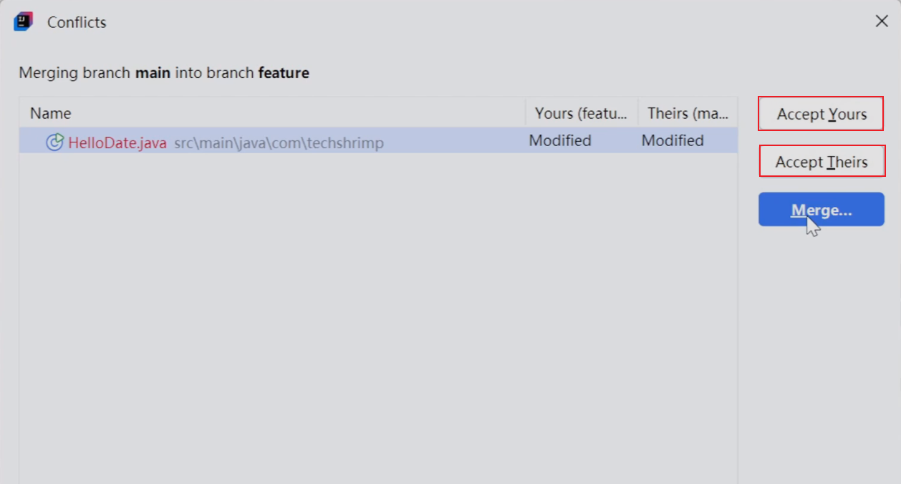

如果选择`Accept Yours`，使用自己的文件，会直接把对方的文件覆盖掉

如果选择`Accept Theirs`，使用对方的文件，就会把你的文件覆盖掉了 

**Merge按钮**可以很优雅的解决冲突

> [!NOTE]
>
> 场景：你的你的同事都在main分支开发代码，然而你的同事已经把带代码提交到了远端，在你执行`git push`命令的时候就会报一个**拒绝错误**，指的是远端有更新的提交，然而本地却没有，此时可以执行一个简单的`git pull`把远端的提交拉取到本地

> [!IMPORTANT]
>
> 使用`git pull`的时候，它会自动创建一个新的**commit**，表示将本地和远端合并起来，但是当项目增大，你的分支历史上的commit会越来越多，显得**杂乱**
>
> 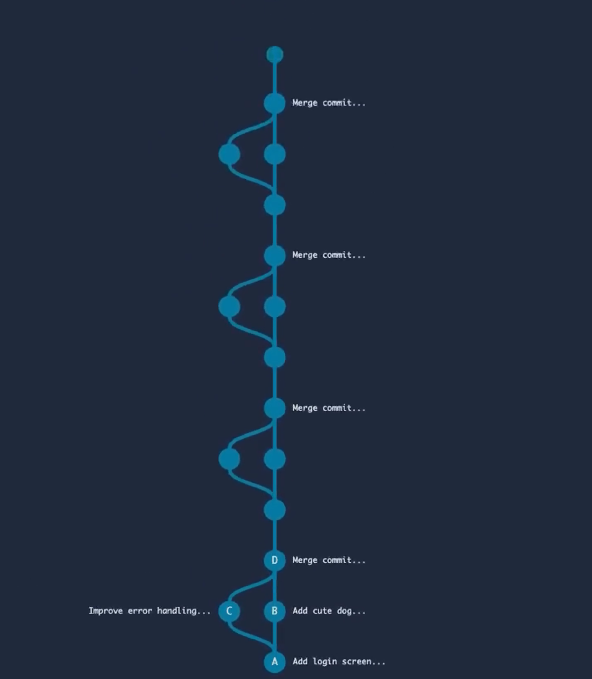
>
> 我们想达成的仅仅是，把自己的提交挂到你同事提交之后，即可使用`git pull rebase`，从而不产生一次新的提交

`git pull --rebase`命令可以把你的提交挂到你同事提交之后，之后即可使用`git push`，不需要强推

**Rollback**

等同于Desktop中的**Discard changes**，

在IDEA中，右键改动，选择Rollback，抛弃掉本地文件的修改

**Reset**

在提交记录中，选择回退版本，想把代码reset到某一个状态，右键选择`Reset Current Branch to Here..`

**Soft**


**Mixed**

撤销掉这次的提交，但是**保留**文件的更改，也就是文件还在工作区

**Hard**

撤销掉这次的提交，**不保留**保留文件的更改

**Keep**

> [!IMPORTANT]
>
> Desktop的reset默认使用的是**mixed**模式，Git也是，

| 命令                       | 效果                                              | 备注     |
| -------------------------- | ------------------------------------------------- | -------- |
| git reset --soft 'commit'  | 撤回提交，撤回的更改保留在暂存区和工作区          |          |
| git reset --mixed 'commit' | 撤回提交与暂存区，撤回的更改保留在工作区          | **推荐** |
| git reset --hard 'commit'  | 撤回提交与暂存区+工作区，不保留任何更改           |          |
| git reset --keep 'commit'  | 撤回提交与暂存区+工作区，未提交的改动保留在工作区 |          |


**revert**

意思是使用一次相反的改动，抵消掉某一次提交的结果

选择一次提交记录，右键选择**Revert Commit**，会生成一次新的提交的，抵消掉选择提交的改动

**amend**

用来修改最近的一次提交（没有 push），不会产生新的提交（修改最近的一次提交而没有引入新的提交）

**已经push的amend**

已经push到远端的commit，不能使用amend进行修改的，修改后只能使用强制推送上去，所以建议已经push到远端的commit不要使用amend修改了

**squash**

在提交记录（历史树），选择多个记录右键，选择**Squash Commits**，它可以把多个提交合并成一个，填一个commit message，即可合并，然后push(不需要强制推送)

> [!WARNING]
>
> 对应已经push到远端的commit，是不能使用**Squash**的

**Cherry Pick**

用于精选一些改动到另一个分支

在一个分支选择一些commit到另一个分支

切换到要添加commit的分支，然后在选择别的分支的一个或多个提交记录，右键选择**Cherry Pick**

当出现冲突时，解决即可

解决完后，点击commit，即完成一次Cherry Pick

**Stash & Shelve**

Stash存储更改

在文件更改区域，右键选择**Git**，再选择**Stash Changes**，填一个message，即可完成保存更改

然后就可以随意切换分支

当回到分支时，可以选择Stash选项卡，把保存的更改再拿回来

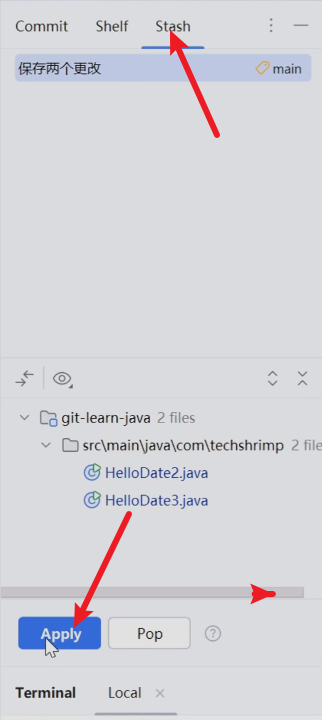

**apply**指的是取回更改，但是不删除保存的更改

**pop**指的是取回更改，同时把保存的更改删除

> [!IMPORTANT]
>
> **局限性**
>
> 一次性把所有文件都保存起来了，并不能选择具体保存哪个文件

shelve

意思是**搁置**，跟stash类似，不过可以选择保存哪一个文件

右键更改文件，选择**shelve Changes**，只会保存选择文件的更改

> [!WARNING]
>
> **shelve Changes**不是git的标准命令

可以选择shelf选项卡，找到文件改动，右键选择**unshelve**，将改动回退，即可取出保存的改动

**git Blame**

在行号处右键**Annotate with Git Blame**，即可显示哪一行代码是谁写的，何时提交的，即可追溯文件作者

在一个文件右键选择Git，再选择show history，会显示处这个文件的历史提交记录及提交情况（追溯文件历史）

这个命令的本质就是`git blame`

在命令行操作：

```bash
git blame 文件路径
```

限定行号

```bash
git blame -L 10,11 文件路径
```

**compare**

比较分支

当处于main分支时，可以在另一个分支处右键，会有个**compare with main**，意思是把main分支和frature(选择分支)分支进行比较一下

有几个部分

**第一部分：**

存在feature分支但是没有存在main分支上的提交

**第二部分**

存在main分支但是没有存在feature分支上的提交

可以进入每次的提交，右侧会显示提交的文件，双击文件可以看到文件的改动


比较提交

在提交文件树中，选择任意一次提交，右键选择**compare with loacal**，左上角就会显示那次提交的状态，和当前分支的区别

**tag**

标记标签

把某一次提交作为项目的重要里程碑或者重要事件，打上一个标记

打开项目历史提交记录，任选一次commit，右键选择**new tag**，填写名字

> [!TIP]
>
> tag的名字是一个版本号，比如 **v1.0.0**

在push的时候，左下角有一个**push tags**选项勾上，右下角会显示成功

## git命令行

### 安装Git

检查是否安装

**git --version**

### 克隆

**git clone url**

### 状态

查看目前的状态，目前分支，是否与远端分支同步，以及文件修改，暂存区...

**git status**

### 提交

**git commit -m 'msg'**

### 推送

**git push**

当第一次推送的时候，会有登录提示，选择GIthub或者Token

Token：进入GIthub点击Setting，下拉找到Developer settings，有一个Personal access tokens

打开，点击Token(classic)，点击Generate new Token

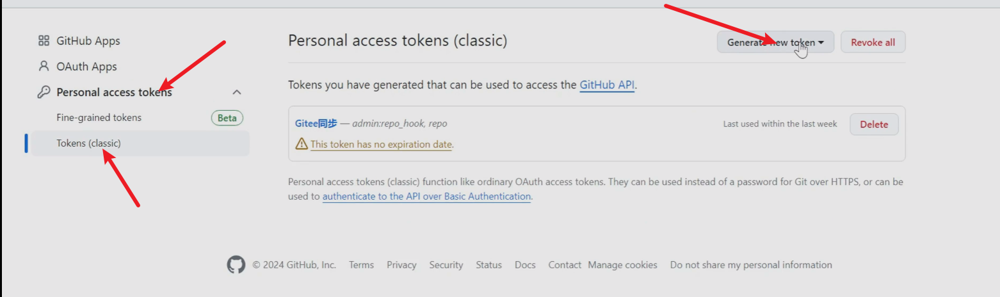


选择一个过期时间，勾选全部功能，最后选择Generate token 

生成了一个Github token，复制，填写到登录Token处即可完成绑定

### 添加暂存区

使用**Git add .** 会把所有修改的文件添加到暂存区

### 取出暂存区

**git restore --staged 'filename'**

### 暂存+提交

**git commit -am 'mag'**

> [!NOTE]
>
> -a的意思是把所有的文件添加到暂存区，
>
> **注意**：只添加修改的文件，新增的文件还是得 git add .

### 拉取

**git pull**

> [!TIP]
>
> 建议使用git pull --rebase，这个命令可以在拉取更新的时候产生线性提交记录

**深入了解**，

当写完代码push到远端，被决绝了，原因是团队中其他同事也使用了相同的分支

两人都是从A提交开始写代码，两人同时在写代码，但是同事先把代码提交到远端

当你推送的时候，就会拒绝

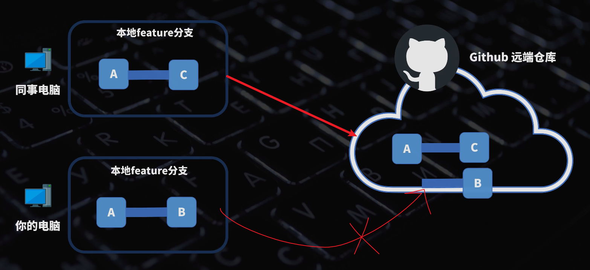

所以，在实践中，推荐每个人都使用一个独立的分支开发代码，避免此类问题

但是，当两个人需要共同解决同一个分支上的问题时，此时，执行git pull 命令即可

先把远端的最新提交拉取到本地

问题是：git pull = git fetch + git merge


因为你的提交和你同事的提交有共同的祖先，Git会merge两个分支的提交，并且创建一个额外的merge提交

经常这么干会累计很多无用信息，把搜索commit变得麻烦，

我们的目的仅仅是：

**把自己的提交挂在你同事提交之后**，即可保持历史数据线性的干净

可以使用git pull --rebase命令，完成操作

此命令会暂时把你的提交放到一边，然后拉取远端仓库的提交，再把你的提交挂在后面，即可保持提交线性的干净

	

使用 git pull


使用git pull --rebase


现在就没有merge提交了

可以修改Git 设置，让Git pull的时候默认使用rebase的方式

```bash
git config pull.rebase true
```

现在使用git pull即使不加--rebase命令也默认使用rebase命令，或者修改为false改回来


Desktop也会变化


在IDEA中，这个Update其实就是Git pull 


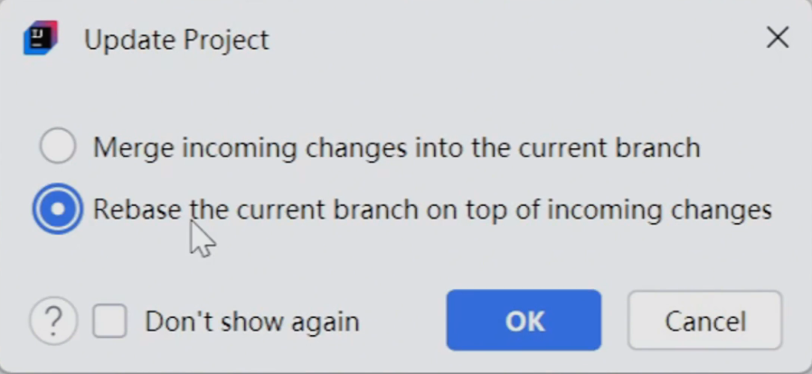

### 重命名 移动 删除

当删除了一个文件，使用git rm 'filename' 告诉git 这个文件以后不需要管理了

或者直接执行git rm 'filename'命令将删除操作添加到暂存区，文件夹内也会删除


移动 git mv 'filename' 'file'，文件名称+文件夹路径，

重命名 git mv 'Oldfilename' 'Newfilename'

### 提交历史

**git log**

### 重置状态

git reset --mixed 'ID' 	文件修改保留在工作区

之后需要使用强制推送(git push -f)

### 丢弃更改

git restore 'filename' 把指定的文件放弃更改

### 提交详细信息

git show 'ID'

### 反向操作

和reset一样属于后悔药的一种

会生成一个反向操作抵消那一次的的更改

git revert 'ID'

填写完提交信息，点击Esc，输入一个冒号，一个wq!，回车

和Vim编辑器一样的

### 修改提交

后悔药的一种

使用git amend修改提交

当代码提交后，突然后悔了，或者改错了，直接在代码中修正，

现在需要把修改加到上一次提交中，

首先git add .

修改上一次的提交记录，git commit --amend

还可以修改上一次的提交信息，点击Esc，冒号，wq!，回车

完成了使用amend操作把上一次添加修改了

> [!IMPORTANT]
>
> amend只能对最后一次提交失效

> [!TIP]
>
> 如果还没有推送，使用git push就行，如果推送了，使用git push -f，强制推送

### 后悔药

- discard
- reset
- revert
- amend

| 操作    | 命令                                                         | 场景                                 | 注意事项                                                     |
| ------- | ------------------------------------------------------------ | ------------------------------------ | ------------------------------------------------------------ |
| discard | git restore 'filename' 单个文件<br />git reset --hard 所有文件 | 工作区的修改还没有提交               | 舍弃掉工作区修改的文件                                       |
| reset   | git reset 'ID'                                               | 还原到某个提交的状态，舍弃之后的提交 | 如果reset已经推送的提交，会造成强制推送，集成分支禁止强制推送 |
| revert  | git revert 'ID'                                              | 使用一个新的提交抵消到某一次的提交   | 在集成分支推荐使用此命令                                     |
| amend   | git commit --amend                                           | 只能修改最新一次的提交               | 如果amend已经push的提交，会造成强制推送...                   |


## Git区概念

- 工作区
- 暂存区
- 本地仓库
- 远程仓库


## 评论

<Giscus />