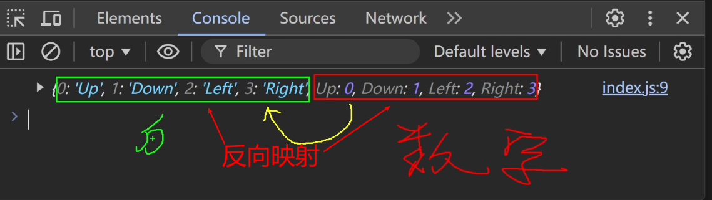

# TypeScript

静态类型检查：

在代码执行前，发现代码的错误或者不合理的地方，减少运行时异常出现的几率，TS的核心就是**静态类型检查**，简而言之就是把**运行时错误前置**

## 命令行编译

全局安装Typescript `npm i typescript -g`

使用命令编译文件 `tsc demo.ts`

## 自动化编译

第一步：创建一个typescript编译控制文件

```
tsc --init
```

> 工程中会生成一个tsconfig.json配置文件，其中包含很多编译时的配置
>
> 观察发现，默认编译的js版本是es7，可以手动更改为其他版本

第二步：监视目录中的`.ts`文件变化

```
tsc --watch
```

第三步：小优化，当编译出错误时不生成`.js`文件

```
tsc --noEmitOnError --watch
```

> 备注：当然也可以通过修改tsconfig.json中的noEmitOnError配置（把对应配置项解开即可）

## 类型声明

```ts
// 限制函数 参数和返回值 的 类型
function count(x:number,y:number):number{
	return x + y
}
// 多传或者少传都不允许
count(1)
count(1,2)
count(1,2,3)
```

### 字面量类型

实际开发很少用  

```ts
let a:'你好' // a的值只能为字符串‘你好’
let b:100 //b的值只能为数字100

a='欢迎' // 警告：不能将类型‘欢迎’分配给类型‘你好’
b=233 // ...
```

## 类型推断

TS会根据代码，进行类型推导，例如：

```ts
let d = 99
d = true // error
```

> 注意：类型推断不是万能的，复杂类型推断容易出问题，尽量还是明确类型声明！

## 类型总览

|                    string                    |
| :------------------------------------------: |
|                    number                    |
|                    string                    |
|                   boolean                    |
|                     null                     |
|                  undefined                   |
|                    bigint                    |
|                    symbol                    |
|                    object                    |
| 其中object包含Array，function，Date，Error等 |

|     Typescript数据类型     |
| :------------------------: |
| 上述所有Javascript数据类型 |
|            any             |
|          unknown           |
|           never            |
|            void            |
|           tuple            |
|            enum            |
|       **自定义类型**       |
|            type            |
|         interface          |

### String-string

不能将类型'`String`'分配给类型'`string`'

`string`是基元，但`String`是包装对象。如有可能首选使用`string`

- 基本字符串
- 字符串包装对象

```ts
let str1:string // 官方推荐写法
str1 = new String('Hellow') // Error

let str2:String 
str2 = new String('Hello')// 既可以写字符串原始类型，也可以写包装对象
```

总结：

`String`对内存不友好，根本没有必要写包装对象，就是**闲得慌**

```js
// 这种写法完全没有必要!!!
let n = new Number(0)
console.log(n.valueOf)
```

**注意点**：在JavaScript中的这些内置构造函数：Number,String,Boolean,它们用于创建对应的包装对象，在日常开发时**很少使用**，在TS中也是同理，所以在TS中进行类型声明的时候，通常都是小写的number，string，boolean

### 了解包装对象

#### 原始类型：

如number，string...，在JavaScript中时简单数据类型，它们在内存中占用空间少，处理速度快

#### 包装对象：

如Number对象，String...，时复杂类型，在内存中占用更多空间，在日常开发中很少由开发人员自己创建包装对象

#### 自动装箱：

JavaScript在必要时会自动将原始类型包装成对象，以便调用方法或属性

```js
// 原始类型字符串
let str = 'hello';

// 当访问str.length时，JavaScript引擎做了以下工作：
let size = (function() {
  // 1. 自动装箱：创建一个临时的String对象包装原始字符串
  let tempStringObject = new String(str);

  // 2. 访问String对象的length属性
  let lengthValue = tempStringObject.length;

  // 3. 销毁临时对象，返回长度值
  // （JavaScript引擎自动处理对象销毁，开发者无感知）
  return lengthValue;
})();

console.log(size); // 输出: 5
```

## 常用类型

### any

TypeScript = AnyScript😅

`any`和含义是：任意类型，一旦将变量类型限制为any，那就意味着**放弃了**对该变量的类型检查

**注意点**：`any`类型的变量，可以赋值给**任意类型的变量**，即会**破坏其他类型**

### unknown

unknown的含义是：**未知类型**

可以理解为一个类型安全的any，**不会破坏其他类型**(不可以赋值给其他类型)，适用于：不确定数据的具体类型 

unknown会强制开发者在使用之前进行类型检查，从而提供更强的类型检查

```ts
let a:unknown
a = 'hello'
let x:string

x = a // error

//解决方案
//第一种
if(typeof a === 'string'){
    x = a
}
//第二种(断言)
x = a as string
//第三种(断言)
x = <string>a
```

读取any类型数据的任何属性都不会报错，而unknown正好相反

```ts
let a:any='hello'
a.toUpperCase() // 无警告

let a:unknown='hello'
a.toUpperCase() // 警告,a的类型为未知
(a as string).toUpperCase() // 解决方案
```

### never

never的含义是：任何值都不是，简而言之就是**不能有值**，undefined,null,'',0都不行！

几乎不用never去限制变量，因为没有意义

作用：用于限制函数返回类型的

```ts
// 限制throwError函数不需要有任何返回值，任何值都不行，像undeifned、null都不行
function demo():never{
    throw new Error('程序运行异常！')
}
//函数只有两种结果
// 1.不能够顺利的调用结束,如果一个js顺利调用了函数，必然会返回一个undefined
// 2. 函数抛出错误
//说白了就是不能结束或者不能正常结束
```

never一般是TS主动推断出来的

```ts
// 指定a的类型为string
let a: string
// 给a设置一个值
a = 'hello'

if (typeof a === 'string') {
  console.log(a.toUpperCase())
} else {
  console.log(a) // TypeScript会推断出此处的a是never，因为没有任何一个值符合此处的逻辑
}
```

### void

`void`的含义是空，即：函数不返回任何值，调用者也不应依赖其返回值进行**任何操作**！

`void`通常用于函数返回值声明

```ts
function logMessage(msg:string):void{
  console.log(msg)
}
logMessage('你好')
```

**注意：**编码者没有编写`return`指定函数返回值，所以`logMessage`函数是没有**显式返回值**的，但会有一个**隐式返回值** ，是`undefined`，虽然函数返回类型为`void`，但也是可以接受`undefined`的，简单记：`undefined`**是**`**void**`**可以接受的一种“空”。**


以下写法均符合规范

```ts
// 无警告
function logMessage(msg:string):void{
  console.log(msg)
}

// 无警告
function logMessage(msg:string):void{
  console.log(msg)
  return;
}

// 无警告
function logMessage(msg:string):void{
  console.log(msg)
  return undefined
}
```

**返回值类型为**`**void**`**的函数，调用者不应该依赖其返回值进行任何操作！**!!!!!!

```ts
function logMessage(msg:string):void{
  console.log(msg)
}

let result = logMessage('你好')

if(result){ // 此行报错：无法测试 "void" 类型的表达式的真实性
  console.log('logMessage有返回值')
}

//-----------------------------------------
function logMessage(msg:string):undefined{
  console.log(msg)
}

let result = logMessage('你好')

if(result){ // 此行无警告
  console.log('logMessage有返回值')
}
```

**理解 void 与 undefined**

- `void`是一个广泛的概念，用来表达“空”，而 `undefined` 则是这种“空”的具体实现。
- 因此可以说 `undefined`是`void`能接受的一种“空”的状态。
- 也可以理解为：`void`包含`undefined`，但`void`所表达的语义超越了`undefined`，`void`是一种意图上的约定，而不仅仅是特定值的限制。  

**总结：**

如果一个函数返回类型为`void`，那么：

1. **从语法上讲**：函数是可以返回`undefined`的，至于显式返回，还是隐式返回，这无所谓！
2. **从语义上讲**：函数调用者不应关心函数返回的值，也不应依赖返回值进行任何操作！即使我们知道它返回了`undefined`。

### object

关于`object`与`Object`，直接说结论：实际开发中用的相对较少，因为范围太大了。

#### object（小写）

`object`（小写）的含义是：所有**非原始类型**，可存储：对象、函数、数组等，由于限制的范围**比较宽泛**，在实际开发中使用的**相对较少**。

```ts
let a:object //a的值可以是任何【非原始类型】，包括：对象、函数、数组等

// 以下代码，是将【非原始类型】赋给a，所以均符合要求
a = {}
a = {name:'张三'}
a = [1,3,5,7,9]
a = function(){}
a = new String('123')
class Person {}
a = new Person()

// 以下代码，是将【原始类型】赋给a，有警告
a = 1         // 警告：不能将类型“number”分配给类型“object”
a = true      // 警告：不能将类型“boolean”分配给类型“object”
a = '你好'    // 警告：不能将类型“string”分配给类型“object” 
a = null      // 警告：不能将类型“null”分配给类型“object”
a = undefined // 警告：不能将类型“undefined”分配给类型“object”
```

#### Object（大写）

官方描述：所有可以调用Object方法的类型

简单回忆：除了undefined和null的任何值

由于限制的范围实在**太大了**！！！所以实际开发使用**频率极低**

```ts
let b:Object //b的值必须是Object的实例对象（除去undefined和null的任何值）

// 以下代码，均无警告，因为给a赋的值，都是Object的实例对象
b = {}
b = {name:'张三'}
b = [1,3,5,7,9]
b = function(){}
b = new String('123')
class Person {}
b = new Person()
b = 1  			// 1不是Object的实例对象，但其包装对象是Object的实例
b = true  	// truue不是Object的实例对象，但其包装对象是Object的实例
b = '你好'	// “你好”不是Object的实例对象，但其包装对象是Object的实例

// 以下代码均有警告
b = null      // 警告：不能将类型“null”分配给类型“Object”
b = undefined // 警告：不能将类型“undefined”分配给类型“Object”
```

#### 声明对象类型

实际开发中，限制一般对象，通常有以下集中形式：

```ts
// 限制person1对象必须有name属性，age为可选属性
let person1: { name: string, age?: number }

// 含义同上，也能用分号做分隔
let person2: { name: string; age?: number }

// 含义同上，也能用换行做分隔
let person3: {
  name: string
  age?: number
}

// 如下赋值均可以
person1 = {name:'李四',age:18}
person2 = {name:'张三'}
person3 = {name:'王五'}

// 如下赋值不合法，因为person3的类型限制中，没有对gender属性的说明
person3 = {name:'王五',gender:'男'}
```

#### 索引签名：

允许定义对象可以具有**任意数量的属性**，这些属性的**键**和**类型**是可变的，常用于：

描述类型不确定的属性，（具有动态属性的对象）

```ts
// 限制person对象必须有name属性，可选age属性但值必须是数字，同时可以有任意数量、任意类型的其他属性
let person: {
  name: string
  age?: number
  [key: string]: any // 索引签名，完全可以不用key这个单词，换成其他的也可以
}

// 赋值合法
person = {
  name:'张三',
  age:18,
  gender:'男' 
}
```

#### 声明函数类型

```ts
let count: (a: number, b: number) => number

count = function (x, y) {
  return x + y 
}
```

备注：

- typescript中的`=>`在函数类型声明时表示**函数类型**，描述其参数类型和**返回类型**
- JavaScript中的`=>`是一种定义函数的语法，是具体的函数的实现，箭头函数
- 函数类型声明还可以使用：**接口，自定义类型**等方式。

#### 声明数组类型

```ts
let arr1: string[] 
let arr2: Array<string>

arr1 = ['a','b','c']
arr2 = ['hello','world']
```

**备注：**上述代码中的`Array<string>`属于泛型

注意：小写变量类型只针对**string,number,boolean**，Array及其他还是大写

### tuple

元组（tuple）是一种特殊的**数组类型，**可以存储**固定数量**的元素，并且每个元素的**类型是已知**的且**可以不同**，元组用于精确描述一组值的类型，`?`表示可选元素

```ts
// 第一个元素必须是 string 类型，第二个元素必须是 number 类型。
let arr1: [string,number]
// 第一个元素必须是 number 类型，第二个元素是可选的，如果存在，必须是 boolean 类型。
let arr2: [number,boolean?]
// 第一个元素必须是 number 类型，后面的元素可以是任意数量的 string 类型
let arr3: [number,...string[]]

// 可以赋值
arr1 = ['hello',123]
arr2 = [100,false]
arr2 = [200]
arr3 = [100,'hello','world']
arr3 = [100]

// 不可以赋值，arr1声明时是两个元素，赋值的是三个
arr1 = ['hello',123,false]
```

###  enum

枚举（enum）可以定义**一组命名常量**，它能增强代码的**可读性**，也让代码**更好维护**

如下代码的功能是：根据调用`walk`时传入的不同参数，执行不同的逻辑，存在的问题是调用`walk`时传参时没有任何提示，编码者很容易写错字符串内容；并且用于判断逻辑的`up`、`down`、`left`、`right`是**连续且相关的一组值**，那此时就特别适合使用 枚举enum

```ts
function walk(str:string) {
  if (str === 'up') {
    console.log("向【上】走");
  } else if (str === 'down') {
    console.log("向【下】走");
  } else if (str === 'left') {
    console.log("向【左】走");
  } else if (str === 'right') {
    console.log("向【右】走");
  } else {
    console.log("未知方向");
  }
}

walk('up')
walk('down')
walk('left')
walk('right')
```



#### 数字枚举

 **1. 数字枚举**

数字枚举一种最常见的枚举类型，其成员的值会**自动递增**，且数字枚举还具备**反向映射**的特点，在下面代码的打印中，不难发现：可以通过**值**来获取对应的枚举**成员名称** 。

```ts
// 定义一个描述【上下左右】方向的枚举Direction
enum Direction {
  Up,
  Down,
  Left,
  Right
}

console.log(Direction) // 打印Direction会看到如下内容
/* 
  {
    0:'Up', 
    1:'Down', 
    2:'Left', 
    3:'Right', 
    Up:0, 
    Down:1, 
    Left:2,
    Right:3
  } 
*/

// 反向映射
console.log(Direction.Up)
console.log(Direction[0])

// 此行代码报错，枚举中的属性是只读的
Direction.Up = 'shang'
```

也可以指定枚举成员的初始值，其后的成员值会自动递增。

```ts
enum Direction {
  Up = 6,
  Down,
  Left,
  Right
}

console.log(Direction.Up); // 输出: 6
console.log(Direction.Down); // 输出: 7
```

使用数字枚举完成刚才`walk`函数中的逻辑，此时我们发现： 代码更加直观易读，而且类型安全，同时也更易于维护。

```ts
enum Direction {
  Up,
  Down,
  Left,
  Right,
}

function walk(n: Direction) { // 表示str只可以写枚举里面规定的值，不能越出
  if (n === Direction.Up) {
    console.log("向【上】走");
  } else if (n === Direction.Down) {
    console.log("向【下】走");
  } else if (n === Direction.Left) {
    console.log("向【左】走");
  } else if (n === Direction.Right) {
    console.log("向【右】走");
  } else {
    console.log("未知方向");
  }
}

walk(Direction.Up)
walk(Direction.Down)
```

#### 字符串枚举

枚举成员的值是字符串

**将丢失反向映射**

```ts
enum Direction {
  Up = "up",
  Down = "down",
  Left = "left",
  Right = "right"
}

let dir: Direction = Direction.Up;
console.log(dir); // 输出: "up"
```

#### 常量枚举	

**官方描述**：常量枚举是一种特殊枚举类型，它使用`const`关键字定义，在编译时会被**内联**，**避免**生成一些**额外**的代码。  

> 何为编译时内联?
>
> 所谓“内联”其实就是 TypeScript 在编译时，会将枚举**成员引用**替换为它们的**实际值**，而不是生成额外的枚举对象。这可以减少生成的 JavaScript 代码量，并提高运行时性能。  

 使用普通枚举的 TypeScript 代码如下：

```ts
enum Directions {
  Up,
  Down,
  Left,
  Right
}

let x = Directions.Up;
```


编译后生成的 JavaScript 代码量较大 ：

```js
"use strict";
var Directions;
(function (Directions) {
    Directions[Directions["Up"] = 0] = "Up";
    Directions[Directions["Down"] = 1] = "Down";
    Directions[Directions["Left"] = 2] = "Left";
    Directions[Directions["Right"] = 3] = "Right";
})(Directions || (Directions = {}));

let x = Directions.Up;
```

使用常量枚举的 TypeScript 代码如下：

```ts
const enum Directions {
  Up,
  Down,
  Left,
  Right
}

let x = Directions.Up;
```

编译后生成的 JavaScript  代码量较小：

```ts
"use strict";
let x = 0 /* Directions.Up */;
```

### type

`type`可以为任意类型创建别名，让代码更简洁、可读性更强，同时能更方便地进行类型复用和扩展。  

#### 基本用法

类型别名使用type关键字定义，type后跟元素类型的别名

```ts
type num = number;
let price: num
price = 100
```

#### 联合类型

**或者**

联合类型是一种高级类型，它表示一个值可以是几种不同类型之一。

```ts
type Status = number | string
type Gender = '男' | '女'

function printStatus(status: Status) {
  console.log(status);
}

function logGender(str:Gender){
  console.log(str)
}

printStatus(404);
printStatus('200');
printStatus('501');

logGender('男')
logGender('女')

```

#### 交叉类型

**并且**

交叉类型（intersection types）允许将多个类型合并为一个类型，合并后的类型将拥有所有被合并类型的成员，交叉类型通常用于对象类型

```ts
//面积
type Area = {
  height: number; //高
  width: number; //宽
};

//地址
type Address = {
  num: number; //楼号
  cell: number; //单元号
  room: string; //房间号
};

// 定义类型House，且House是Area和Address组成的交叉类型
type House = Area & Address;

const house: House = {
  height: 180,
  width: 75,
  num: 6,
  cell: 3,
  room: '702'
};
```

### 一个特殊情况

<details class="lake-collapse"><summary id="u0a2d80cb"><strong><span class="ne-text">代码段1（正常）</span></strong></summary><p id="u027c1b95" class="ne-p" style="margin: 0; padding: 0; min-height: 24px"><span class="ne-text">在函数定义时，限制函数返回值为</span><code class="ne-code" style="font-family: SFMono-Regular, Consolas, Liberation Mono, Menlo, Courier, monospace; background-color: rgba(0, 0, 0, 0.06); border: 1px solid rgba(0, 0, 0, 0.08); border-radius: 2px; padding: 0px 2px"><span class="ne-text">void</span></code><span class="ne-text">，那么函数的返回值就必须是空。</span></p><pre data-language="typescript" id="FAUfe" class="ne-codeblock language-typescript" style="border: 1px solid #e8e8e8; border-radius: 2px; background: #f9f9f9; padding: 16px; font-size: 13px; color: #595959"><code>function demo():void{
  // 返回undefined合法
  return undefined

  // 以下返回均不合法
  return 100
  return false
  return null
  return []
}
demo()</code></pre></details>

<details class="lake-collapse"><summary id="u2d186dd2"><strong><span class="ne-text">代码段2（特殊）</span></strong></summary><p id="u8f9e92dd" class="ne-p" style="margin: 0; padding: 0; min-height: 24px"><span class="ne-text">使用</span><strong><span class="ne-text" style="color: rgb(34, 73, 254)">类型声明</span></strong><span class="ne-text">限制函数返回值为</span><code class="ne-code" style="font-family: SFMono-Regular, Consolas, Liberation Mono, Menlo, Courier, monospace; background-color: rgba(0, 0, 0, 0.06); border: 1px solid rgba(0, 0, 0, 0.08); border-radius: 2px; padding: 0px 2px"><span class="ne-text">void</span></code><span class="ne-text">时，</span><code class="ne-code" style="font-family: SFMono-Regular, Consolas, Liberation Mono, Menlo, Courier, monospace; background-color: rgba(0, 0, 0, 0.06); border: 1px solid rgba(0, 0, 0, 0.08); border-radius: 2px; padding: 0px 2px"><strong><span class="ne-text" style="color: #DF2A3F">TypeScript</span></strong></code><strong><span class="ne-text" style="color: #DF2A3F">并不会严格要求函数返回空。</span></strong></p><pre data-language="typescript" id="nYD9q" class="ne-codeblock language-typescript" style="border: 1px solid #e8e8e8; border-radius: 2px; background: #f9f9f9; padding: 16px; font-size: 13px; color: #595959"><code>type LogFunc = () =&gt; void

const f1: LogFunc = () =&gt; {
  return 100; // 允许返回非空值
};

const f2: LogFunc = () =&gt; 200; // 允许返回非空值

const f3: LogFunc = function () {
  return 300; // 允许返回非空值
};
</code></pre></details>

<details class="lake-collapse"><summary id="u7d4a3f76"><strong><span class="ne-text">为什么会这样？</span></strong></summary><p id="uf0968d2d" class="ne-p" style="margin: 0; padding: 0; min-height: 24px"><span class="ne-text">是为了确保如下代码成立，我们知道 </span><code class="ne-code" style="font-family: SFMono-Regular, Consolas, Liberation Mono, Menlo, Courier, monospace; background-color: rgba(0, 0, 0, 0.06); border: 1px solid rgba(0, 0, 0, 0.08); border-radius: 2px; padding: 0px 2px"><span class="ne-text">Array.prototype.push</span></code><span class="ne-text"> 的返回值是一个数字，而</span><code class="ne-code" style="font-family: SFMono-Regular, Consolas, Liberation Mono, Menlo, Courier, monospace; background-color: rgba(0, 0, 0, 0.06); border: 1px solid rgba(0, 0, 0, 0.08); border-radius: 2px; padding: 0px 2px"><span class="ne-text">Array.prototype.forEach</span></code><span class="ne-text">方法期望其回调的返回类型是</span><code class="ne-code" style="font-family: SFMono-Regular, Consolas, Liberation Mono, Menlo, Courier, monospace; background-color: rgba(0, 0, 0, 0.06); border: 1px solid rgba(0, 0, 0, 0.08); border-radius: 2px; padding: 0px 2px"><span class="ne-text">void</span></code><span class="ne-text">。</span></p><pre data-language="typescript" id="Y0fZt" class="ne-codeblock language-typescript" style="border: 1px solid #e8e8e8; border-radius: 2px; background: #f9f9f9; padding: 16px; font-size: 13px; color: #595959"><code>const src = [1, 2, 3];
const dst = [0];

src.forEach((el) =&gt; dst.push(el));</code></pre></details>

官方文档的说明：[Assignability  of Functions](https://www.typescriptlang.org/docs/handbook/2/functions.html#assignability-of-functions)

### 复习类相关知识

```ts
class Person {
  // 属性声明
  name: string
  age: number
  // 构造器
  constructor(name: string, age: number) {
    this.name = name
    this.age = age
  }
  // 方法
  speak() {
    console.log(`我叫：${this.name}，今年${this.age}岁`)
  }
}

// Person实例
const p1 = new Person('周杰伦', 38)
```

```ts
class Student extends Person {
  grade: string
  // 构造器
  constructor(name: string, age: number, grade: string) {
    super(name, age)
    this.grade = grade
  }
  // 备注本例中若Student类不需要额外的属性，Student的构造器可以省略
  // 重写从父类继承的方法
  override speak() {
    console.log(`我是学生，我叫：${this.name}，今年${this.age}岁，在读${this.grade}年级`,)
  }
  // 子类自己的方法
  study() {
    console.log(`${this.name}正在努力学习中......`)
  }
}
```

**练习**

```ts
class person {
  name: string  //声明person类应该具有以下属性
  age: number
  constructor(name: string, age: number) {  // 构造器
    this.name = name // 往实例上添加属性
    this.age = age
  }
  say() {
    console.log(`我的名字是${this.name}，我的年龄是${this.age}岁`);
  }
}
const student1 = new person('张三', 17)
student1.say()
const student2 = new person('李四', 20)
student2.say()

class student extends person {
  // 细节 如果确定student不需要额外属性的，直接省略构造器
  grade: string
  constructor(name: string, age: number, grade: string) {
    super(name, age) // 调用父类构造器 将name和age传过去
    this.grade = grade //放到实例身上
  }
  study() {
    console.log(`我是${this.name},我正常努力学习中....`);
    console.log(`我是${this.grade}的`);
  }
  override say() { //防止 复写名字 写错
    console.log(`老子名字叫做${this.name}，我就是${this.age}岁`); // 重写父类方法
  }
}
const student3 = new student('王五', 23, '三年一班')
student3.study()
student3.say()
```

**注意：super关键字在添加（修改）继承属性的时候调用，**(**重写构造方法**)

### 属性修饰符

| 修饰符    | 含义     | 具体规则                             |
| --------- | -------- | ------------------------------------ |
| public    | 公开的   | 可以被：**类内部，子类，类外部**访问 |
| protected | 受保护的 | 可以被：**类内部，子类**访问         |
| private   | 私有的   | 可以被：**类内部**访问               |
| readonly  | 只读属性 | 属性无法修改                         |


```ts
// public
class Person {
  // name写了public修饰符，age没写修饰符，最终都是public修饰符
  public name: string // 实际开发 要么都加 要么都不加
  age: number
  constructor(name: string, age: number) {
    this.name = name
    this.age = age
  }
  speak() {
    // 类的【内部】可以访问public修饰的name和age
    console.log(`我叫：${this.name}，今年${this.age}岁`)
  }
}

class Student extends Person {
  constructor(name: string, age: number) {
    super(name, age)
  }
  study() {
    // 【子类中】可以访问父类中public修饰的：name属性、age属性
    console.log(`${this.age}岁的${this.name}正在努力学习`)
  }
}

const p1 = new Person('张三', 18)
// 类的【外部】可以访问public修饰的属性
console.log(p1.name)
```
```ts
//属性的简写形式

// 完整写法
class Person {
  public name: string;
  public age: number;

  constructor(name: string, age: number) {
      this.name = name;
      this.age = age;
  }
}
//-----------------------------------------------------

// 简写形式
class Person {
  constructor(
    public name: string,
    public age: number
  ) { }
}
```
```ts
// protected
class Person {
  // name和age是受保护属性，不能在类外部访问，但可以在【类】与【子类】中访问
  constructor(
    protected name: string,
    protected age: number
  ) {}
  // getDetails是受保护方法，不能在类外部访问，但可以在【类】与【子类】中访问
  protected getDetails(): string {
    // 类中能访问受保护的name和age属性
    return `我叫：${this.name}，年龄是：${this.age}`
  }
  // introduce是公开方法，类、子类、类外部都能使用
  introduce() {
    // 类中能访问受保护的getDetails方法
    console.log(this.getDetails());
  }
}

const p1 = new Person('杨超越',18)
// 可以在类外部访问introduce
p1.introduce()

// 以下代码均报错
// p1.getDetails()
// p1.name
// p1.age
//--------------------------------------------------------------
class Student extends Person {
  constructor(name:string,age:number){
    super(name,age)
  }
  study(){
    // 子类中可以访问introduce
    this.introduce()
    // 子类中可以访问name
    console.log(`${this.name}正在努力学习`)
  }
}

const s1 = new Student('tom',17)
s1.introduce()
```
```ts
// private 
class Person {
  constructor(
    public name: string,
    public age: number,
    // IDCard属性为私有的(private)属性，只能在【类内部】使用
    private IDCard: string
  ) { }
  private getPrivateInfo(){
    // 类内部可以访问私有的(private)属性 —— IDCard
    return `身份证号码为：${this.IDCard}`
  }
  getInfo() {
    // 类内部可以访问受保护的(protected)属性 —— name和age
    return `我叫: ${this.name}, 今年刚满${this.age}岁`;
  }
  getFullInfo(){
    // 类内部可以访问公开的getInfo方法，也可以访问私有的getPrivateInfo方法
    return this.getInfo() + '，' + this.getPrivateInfo()
  }
}

const p1 = new Person('张三',18,'110114198702034432')
console.log(p1.getFullInfo())
console.log(p1.getInfo())

// 以下代码均报错
// p1.name
// p1.age
// p1.IDCard
// p1.getPrivateInfo()
```
```ts
//readonly 
class Car {
  constructor(
    public readonly vin: string, //车辆识别码，为只读属性
    public readonly year: number,//出厂年份，为只读属性
    public color: string,
    public sound: string
  ) { }

  // 打印车辆信息
  displayInfo() {
    console.log(`
      识别码：${this.vin},
      出厂年份：${this.year},
      颜色：${this.color},
      音响：${this.sound}
    `);
  }
}

const car = new Car('1HGCM82633A123456', 2018, '黑色', 'Bose音响');
car.displayInfo()

// 以下代码均错误：不能修改 readonly 属性
// car.vin = '897WYE87HA8SGDD8SDGHF'; 
// car.year = 2020; 
```

### 抽象类

- **概述**：抽象类是一种**无法被实例化**的类，专门用来定义类的**结构和行为**，类中可以写**抽象方法**，也可以写**具体实现**。抽象类主要用来为其派生类提供一个**基础结构**，要求其派生类**必须实现**其中的抽象方法。  
- **简记**：抽象类**不能实例化**，其意义是**可以被继承**，抽象类里可以有**普通方法**、也可以有**抽象方法**。

通过以下场景，理解抽象类：

> 我们定义一个抽象类`Package`，表示所有包裹的基本结构，任何包裹都有重量属性`weight`，包裹都需要计算运费。但不同类型的包裹（如：标准速度、特快专递）都有不同的运费计算方式，因此用于计算运费的`calculate`方法是一个抽象方法，必须由具体的子类来实现。  

```ts
abstract class Package {
  constructor(public weight: number) { }
  // 抽象方法：用来计算运费，不同类型包裹有不同的计算方式
  abstract calculate(): number
  // 通用方法：打印包裹详情
  printPackage() {
    console.log(`包裹重量为: ${this.weight}kg，运费为: ${this.calculate()}元`);
  }
}
```

`StandardPackage`类继承了`Package`，实现了`calculate`方法：

```ts
// 标准包裹
class StandardPackage extends Package {
  constructor(
    weight: number,
    public unitPrice: number // 每公斤的固定费率
  ) { super(weight) }

  // 实现抽象方法：计算运费
  calculate(): number {
    return this.weight * this.unitPrice;
  }
}

// 创建标准包裹实例
const s1 = new StandardPackage(10,5)
s1.printPackage()
```

**总结：何时使用**抽象类？

1. **定义**通用接口：为一组相关的类定义通用的行为（方法或属性）时。  
2. **提供**基础实现：在抽象类中提供某些方法或为其提供基础实现，这样派生类就可以继承这些实现。
3. **确保**关键实现 **：**强制派生类实现一些关键行为。
4. **共享**代码和逻辑：当多个类需要共享部分代码时，抽象类可以避免代码重复。  

### interface

`interface`是一种**定义结构**的方式，主要作用是为：类、对象、函数等规定**一种契约**，这样可以确保代码的一致性和类型安全，但要注意`interface`**只能**定义**格式**，**不能**包含**任何实现** ！

#### **定义**类**结构**

```ts
// PersonInterface接口，用与限制Person类的格式
interface PersonInterface {
  name: string
  age: number
  speak(n: number): void
}

// 定义一个类 Person，实现 PersonInterface 接口
class Person implements PersonInterface {
  constructor(
    public name: string,
    public age: number
  ) { }
  // 实现接口中的 speak 方法
  speak(n: number): void {
    for (let i = 0; i < n; i++) {
      // 打印出包含名字和年龄的问候语句
      console.log(`你好，我叫${this.name}，我的年龄是${this.age}`);
    }
  }
}

// 创建一个 Person 类的实例 p1，传入名字 'tom' 和年龄 18
const p1 = new Person('tom', 18);
p1.speak(3)
```

#### **定义**对象**结构**

```ts
interface UserInterface {
  name: string
  readonly gender: string // 只读属性
  age?: number // 可选属性
  run: (n: number) => void
}

const user: UserInterface = {
  name: "张三",
  gender: '男',
  age: 18,
  run(n) {
    console.log(`奔跑了${n}米`)
  }
};

```

#### **定义**函数**结构**

```ts
interface CountInterface {
  (a: number, b: number): number;
}

const count: CountInterface = (x, y) => {
  return x + y
}
```

#### **接口之间的继承**

一个`interface`继承另一个`interface`，从而实现代码的复用

```ts
interface PersonInterface {
  name: string // 姓名
  age: number  // 年龄
}

interface StudentInterface extends PersonInterface {
  grade: string // 年级
}

const stu: StudentInterface = {
  name: "张三",
  age: 25,
  grade: '高三',
}
```

#### **接口自动合并（可重复定义）**

```ts
// PersonInterface接口
interface PersonInterface {
  // 属性声明
  name: string
  age: number
}

// 给PersonInterface接口添加新属性
interface PersonInterface {
  // 方法声明
  speak(): void
}

// Person类实现PersonInterface
class Person implements PersonInterface {
  name: string
  age: number
  // 构造器
  constructor(name: string, age: number) {
    this.name = name
    this.age = age
  }
  // 方法
  speak() {
    console.log('你好！我是老师:', this.name)
  }
}
```

**总结：何时使用接口？**

1. **定义对象的格式：** 描述数据模型、API 响应格式、配置对象........等等，是开发中用的最多的场景。
2. **类的契约：**规定一个类需要实现哪些属性和方法。
3. **扩展已有接口：**一般用于扩展第三方库的类型， 这种特性在大型项目中可能会用到。

### 一些相似概念的区别

#### interface 与 type 的区别

- **相同点：**`interface`和`type` 都可以用于定义**对象结构**，在定义对象结构时两者可以互换。
- **不同点：**

1️⃣`interface`：更专注于定义**对象**和**类**的结构，支持**继承**、**合并**。

2️⃣`type`：可以定义**类型别名、联合类型**、**交叉类型**，但不支持继承和自动合并。

##### interface 和 type 都可以定义对象结构

```ts
// 使用 interface 定义 Person 对象
interface PersonInterface {
  name: string;
  age: number;
  speak(): void;
}

// 使用 type 定义 Person 对象
type PersonType = {
  name: string;
  age: number;
  speak(): void;
};

// 使用PersonInterface
/* let person: PersonInterface = {
  name:'张三',
  age:18,
  speak(){
    console.log(`我叫：${this.name}，年龄：${this.age}`)
  }
} */

// 使用PersonType
let person: PersonType = {
  name:'张三',
  age:18,
  speak(){
    console.log(`我叫：${this.name}，年龄：${this.age}`)
  }
}
```

##### interface 可以继承、合并

```ts
interface PersonInterface {
  name: string // 姓名
  age: number  // 年龄
}

interface PersonInterface {
  speak: () => void
}

interface StudentInterface extends PersonInterface {
  grade: string // 年级
}

const student: StudentInterface = {
  name: '李四',
  age: 18,
  grade: '高二',
  speak() {
    console.log(this.name,this.age,this.grade)
  }
}
```

##### type 的交叉类型

```ts
// 使用 type 定义 Person 类型，并通过交叉类型实现属性的合并
type PersonType = {
  name: string; // 姓名
  age: number;  // 年龄
} & {
  speak: () => void;
};

// 使用 type 定义 Student 类型，并通过交叉类型继承 PersonType
type StudentType = PersonType & {
  grade: string; // 年级
};

const student: StudentType = {
  name: '李四',
  age: 18,
  grade: '高二',
  speak() {
    console.log(this.name, this.age, this.grade);
  }
};
```

#### interface 与 抽象类的区别

- **相同点：**都能定义一个**类的格式**（定义类应遵循的契约）  
- **不相同：**

1️⃣接口：**只能**描述**结构**，**不能**有任何**实现代码**，一个类可以实现**多个**接口。

2️⃣抽象类：既可以包含**抽象方法**，也可以包含**具体方法**， 一个类只能继承**一个**抽象类。

**一个类可以实现多个接口**

```ts
// FlyInterface 接口
interface FlyInterface {
  fly(): void;
}

// 定义 SwimInterface 接口
interface SwimInterface {
  swim(): void;
}

// Duck 类实现了 FlyInterface 和 SwimInterface 两个接口
class Duck implements FlyInterface, SwimInterface {
  fly(): void {
    console.log('鸭子可以飞');
  }

  swim(): void {
    console.log('鸭子可以游泳');
  }
}

// 创建一个 Duck 实例
const duck = new Duck();
duck.fly();  // 输出: 鸭子可以飞
duck.swim(); // 输出: 鸭子可以游泳
```

## 泛型

泛型允许我们在定义函数、类或接口时，使用类型参数来表示**未指定的类型**，这些参数在具体**使用时**，才被指定**具体的类型**，泛型能让同一段代码适用于多种类型，同时仍然保持类型的安全性。


举例：如下代码中`<T>`就是泛型，（不一定非叫`T`），设置泛型后即可在函数中使用`T`来表示该类型：

**泛型函数**

```ts
function logData<T>(data: T): T {
  console.log(data)
  return data
}

logData<number>(100)
logData<string>('hello')
```

**泛型可以有多个**

```ts
function logData<T, U>(data1: T, data2: U): T | U {
  console.log(data1,data2)
  return Date.now() % 2 ? data1 : data2
}

logData<number, string>(100, 'hello')
logData<string, boolean>('ok', false)
```

**泛型接口**

```ts
interface PersonInterface<T> {
  name: string,
  age: number,
  extraInfo: T
}

let p1: PersonInterface<string>
let p2: PersonInterface<number>

p1 = { name: '张三', age: 18, extraInfo: '一个好人' }
p2 = { name: '李四', age: 18, extraInfo: 250 }
```

**泛型约束**

```ts
interface LengthInterface {
  length: number
}

// 约束规则是：传入的类型T必须具有 length 属性
function logPerson<T extends LengthInterface>(data: T): void {
  console.log(data.length)
}

logPerson<string>('hello')
// 报错：因为number不具备length属性
// logPerson<number>(100)
```

**泛型类**

```ts
class Person<T> {
  constructor(
    public name: string,
    public age: number,
    public extraInfo: T
  ) { }
  speak() {
    console.log(`我叫${this.name}今年${this.age}岁了`)
    console.log(this.extraInfo)
  }
}

// 测试代码1
const p1 = new Person<number>("tom", 30, 250);

// 测试代码2
type JobInfo = {
  title: string;
  company: string;
}
const p2 = new Person<JobInfo>("tom", 30, { title: '研发总监', company: '发发发科技公司' });
```

## 类型声明文件

类型声明文件是 TypeScript 中的一种特殊文件，通常以`.d.ts` 作为扩展名。它的主要作用是为现有的 **JavaScript 代码**提供**类型信息**，使得 TypeScript 能够在使用这些 JavaScript 库或模块时进行**类型检查和提示**。  

### **demo.js**

```ts
export function add(a, b) {
  return a + b;
}

export function mul(a, b) {
  return a * b;
}

```

### demo.d.ts

```ts
declare function add(a: number, b: number): number;
declare function mul(a: number, b: number): number;

export { add, mul };
```

### index.ts

```ts
// example.ts
import { add, mul } from "./demo.js";

const x = add(2, 3); // x 类型为 number
const y = mul(4, 5); // y 类型为 number

console.log(x,y)
```

